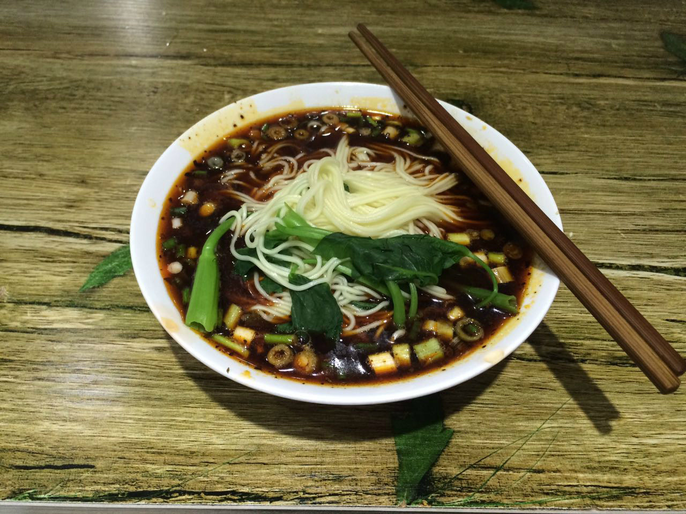
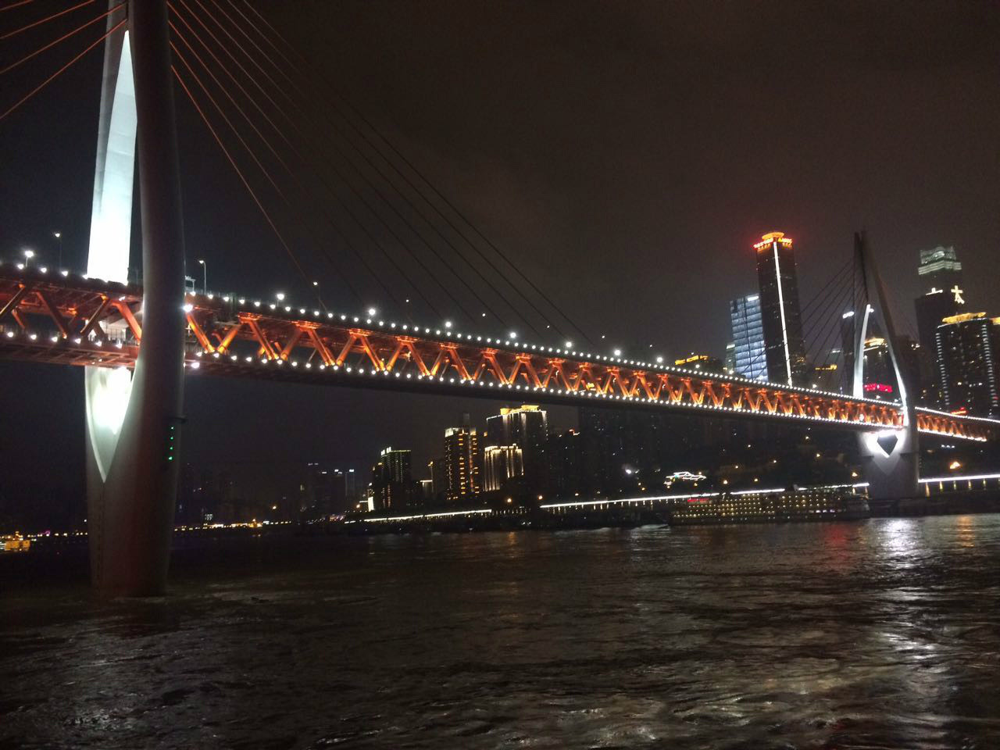
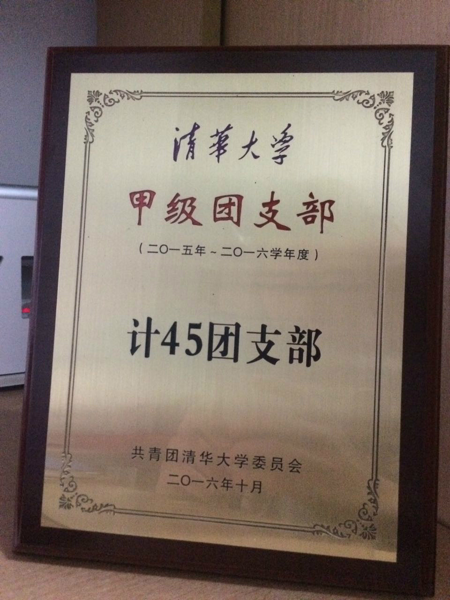
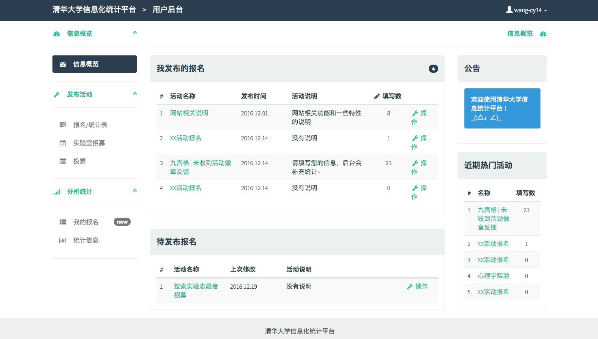
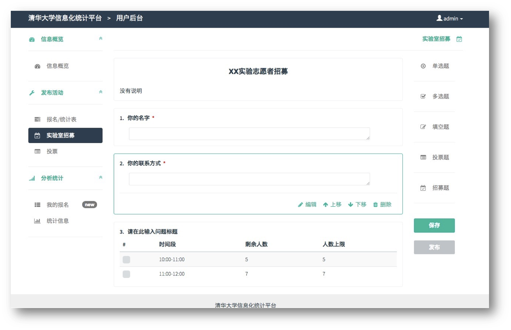
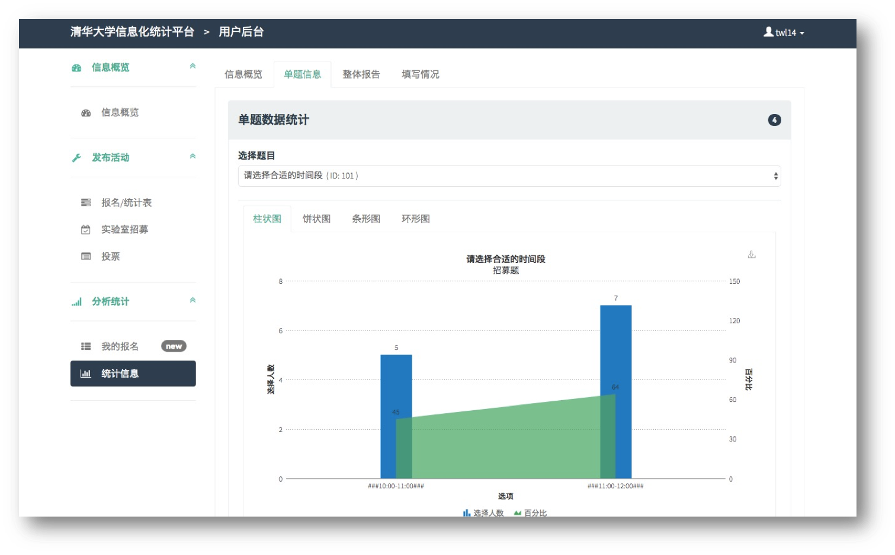
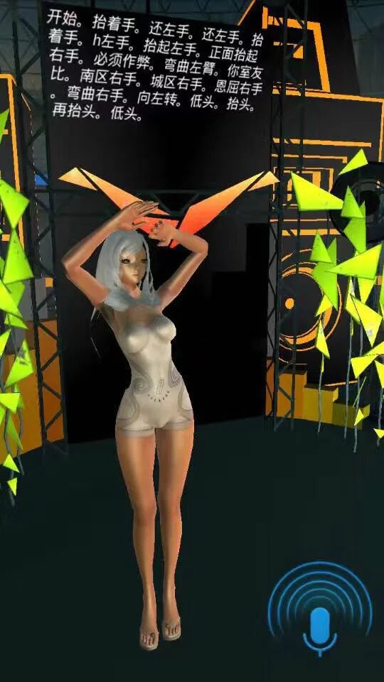
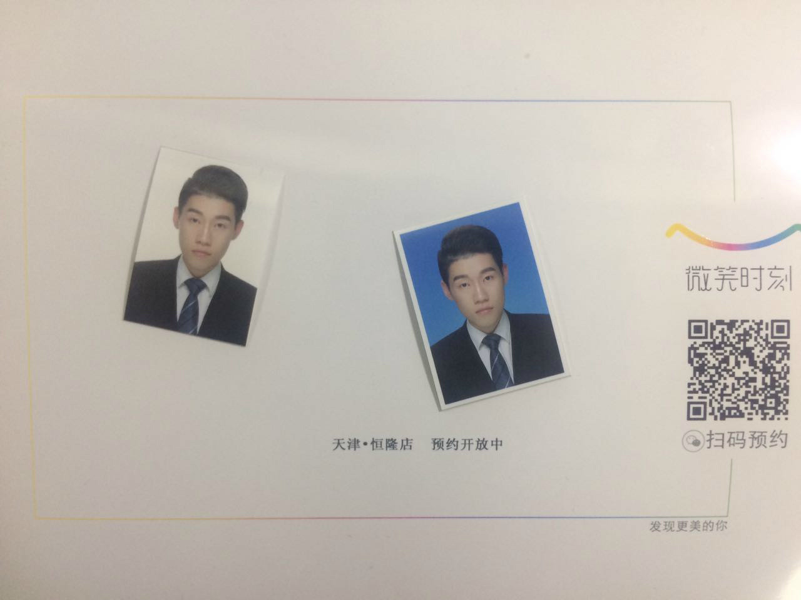

这学期想不出什么一句话能概括的题目了：劫后重生？毕竟是我们系大作业最多、最难熬的一学期，估计像我这样本身不是大腿又强行在所有大作业中打carry位的不多了，其中的艰难估计只有当时的自己知道，因为结束后倒感觉都还好；又或者是命运分岔路口？这学期的一些决定对于毕业后的去向问题还是有不小影响的，这个后面再说。

这次总结打算少写一点，只挑重点，多放图片，看起来应该会舒服一些，不像之前一样动辄上万字了[捂脸]。

### 重庆实践

暑假在家待的时间很短，就是因为参加这个班团骨干赴重庆的实践，体验一下学校官方组织的实践是什么样的。实际证明，这个实践的逼格确实比自己组织的高出很多。

然而过了一学期，现在印象最深的已经只是重庆的夜景和火锅了… 重庆夜景着实漂亮，以至于十一假期在天津看天津之眼的夜景，都有种曾经沧海的感觉；火锅也着实辣，每次吃完比拉肚子，但实在是香，即使拉肚子也会去狂吃一顿。

重庆小面

九宫格火锅

重庆夜景

洪崖洞

至于调研的内容，我们深入重庆市长寿区保合村，调研一家农村电商公司的发展。在村里那几天，每天出的汗足够洗澡。调研方式大多为和村民、村干部、公司负责人聊天，确实聊出一些问题，比如资金不到位、国家支持不足、村民电商意识淡薄。到最后给我的感觉就像是村里为了造政绩才办的电商公司，其实经营状况并不乐观，村民多数也不买账。本来是来取经的，结果调研出一些失败经验，也是挺有趣。

另外收获很大的一方面是在和其他同学的相处中。同行同学都是各个班级的骨干，学到了很多说话、沟通、处事的技巧，感到自己还有很大提升空间，回来之后也在学着去改变。这可能才是这次实践对我提高最大的一点。

小组合照

实践团建

### 社工

- **团支书**

首先是成功卸任了当了一年的团支书，这一年自我感觉一般但还算成功。这学期初没换届的时候又试着写材料去评选一下校级甲团，没想到还评上了，并且混了个“校优秀学生干部”，太惭愧… 不过也算完美卸任了。

校甲团证书

- **学生会**

这学期本来想专心学习挺过各科大作业的，结果还是接了学生会运营部副主席的锅，其实最开始不是很有信心带好小朋友们。但既然接锅就要好好干，学期初想了很多对部里工作的改善，但最后也只实现了一部分。这学期除了日常事务之外，主要的功劳也许就是做起来了“酒井名人堂”这一微信公众平台栏目，并且布置了一个还不错的学生节外场。

担任了副主席才知道承担的压力是原来做部员的好多倍。一方面可能因为运营部本身有很多工作，比如报销、和老师沟通协调等只能副主席出马，部员其实并不知道这些活；另一方面以前做部员时有些事解决不了就可以丢给当时的副主席擦屁股，现在只能自己咬牙解决。特别是筹备学生节时，各种各样琐碎的事特别多，还有些出特殊状况必须想方设法去搞定。比如其中的一个纪念品书签差点都没做出来，那几天每天都打电话催，协商方案，才在最终装袋前把货送到。每当想到学生节正常流程可能因为我这边的情况收到影响，就不由自主地焦虑，那几天真的是连睡觉都睡不好。好在最后结局圆满，学生节顺利结束，我们部的工作也都出色完成。

至于对部员人生规划的引导方面，确实还欠缺一些。自认为没有以前的副主席那么能说，没能在开完会顺便传授一些人生经验，特别是有时候手头上还压着软工、计原大作业时，开完会就没心思多聊了。但自认考虑问题、分锅什么的还是比较细致的，相信他们完成任务会比我那时候得心应手。下学期我也要和他们多聊一聊，一方面找下一任接班人，一方面让小朋友们除了在部里工作真正收获一些东西。

### 学习

之前就知道这学期课程比较艰难，所以没选乱七八糟的课，只选了喜欢的专业课。然而过程还是很艰难，得到最大的教训就是至少要在某一两个大作业抱一抱大腿。现在想一想，软工大作业、计原大作业、人机交互-美双联合大作业都是自己承担了主要码力，再加上当时其他课杂七杂八的小作业，真不知道当时是怎么熬过来的。还好队友也都比较靠谱，在此感谢队友。

成绩上自从大二下立志好好提高一下GPA，一直还算不错，算上这学期总算填上了大二上的坑，把成绩又拉回了之前的水平，希望之后能继续保持。

- 小学期

这次暑期小学期分为JAVA小学期和汇编小学期两个，JAVA小学期写了一个新闻资讯安卓app，从给的接口拉取新闻信息并展示。实现并不难，主要难在从头开始学习安卓应用开发，配环境和模拟器花了很大功夫。当时还参加了大作业创意大赛，可惜只得了第四名，没拿到想要的奖品。最终实现出来大家都差不太多，我的主要特点可能就是设计了logo和欢迎界面，还改了改主题颜色，看起来和多数人就不太一样了hhh。

应用主界面

应用侧边栏

汇编刚开始感觉很枯燥，后来又觉得挺有意思，特别是当时一个利用栈溢出写汇编代码进行类似黑客攻击的作业，做起来非常爽，毕竟是从国外搬过来的课件和作业，作业里每个level还有象征性的比喻，特别用心。

- 三年级男生台球  [78]

人品爆发选上的台球课，和白教员一节。从刚开始球都打不准被狂虐到最后能和白教员一较高下，进步还是不少的，以后出去玩至少不丢人了。另外可喜的是3000米没有比大二退步1分钟，很欣慰。

- 信号处理原理  [93]

傅里叶变换什么乱七八糟的，平常上课没怎么听懂，作业靠啃书能摸索着做，matlab实验比前几届也减少了很多，不过借此几乎学习了一下matlab还是不错的。整体算是一门平时没怎么学过，考前疯狂复习的课，确实也不太感兴趣。可惜期末没复习小波变换，运气又不好，送了一道占总评5分的选择题。

- 软件工程  [89]

这个课分不高确实在意料之内，毕竟做出的网站不如其他组做的好，而且开始造计算机之后就完全没有进展了。但这门课感觉还是学到很多的，我们的项目是做一个类似问卷星的简化版的网站，使其用起来更便捷。我负责整体架构和前端，一切都从头学起，网站框架、html、js、css，好在刚开始借鉴了黄大大和葱他们当时项目的框架才得以顺利起步。最初还很有信心，想要做一个真正能拿出来用的网站，进度在初期也算比较快的组。可惜到后期有别的事之后就写得越来越少了，也越来越疲倦了，很多功能实现得自己都觉得很不满意。作为组长也不催组员干活了，最后就完全处于搁置状态了。临检查时抓紧设计了个logo、优化了一下界面就交了。最后展示效果也一般，没有像其他大佬那么用心准备。

现在想想真是挺虎头蛇尾的，还记得最开始每天中午吃完饭只要下午没课，就去北馆呆一下午写软工的时候，可惜后来没能坚持好好写。但学习了不少前端的知识，深感前端是一个坑很深却也很有趣的方向，以后也许还会做一点前端的工作。最终贡献了总项目50%的代码量，应该是这学期写的最多的一个大作业了。

网站首页

问卷设计页面

问卷统计页面

  最后附上[github的链接](https://github.com/THUwangcy/Tsinghua-Statistical-Information-Platform)

- 人机交互理论与技术  [89]

史元春姐姐的课，但课上真心没学到什么东西，都是人机交互发展历史和一些显而易见的交互领域的理论。平常的小作业基本都是文科题，比较麻烦的是个人实验报告还有团队大作业。在个人实验报告中感受了写论文时数据处理的不容易，这里是用一堆实验数据验证Fitt’s Law。写的还算不错，还被挑上去展示。大作业和美双要求一样，就一起写了。最终做出一个很迷的语音控制跳舞的安卓游戏，自学unity，写得不算很用心，只在周末有空时写一点，主要工作都花在unity学习上了，代码量到没多少，最终完成度不是很高。

这个也腆着脸附上[github链接](https://github.com/THUwangcy/Dance)吧

游戏开始界面

游戏中

- 编译原理  [96]

王生原良心教案和作业，贯穿一学期的各阶段实验，最终实现了一个用JAVA编写的decaf语言编译器。作业讲解详细，做起来特别舒畅。各阶段实验难度也不高，都是在已有代码基础上实现新语言特性的编译，除了PA4基本都是照猫画虎。自己对编译也算挺感兴趣，每次实验都很早去研究做完。最后考试内容大而全，整整十几页的考题，好在给分真的良心，之后可能还会再自学一些编译的内容。

- 计算机组成原理  [92]

最出名的“奋战三星期，造台计算机“，其实造完感觉并没有想象中那么难。和队友分工之后，第一次合并就跑通了流水线的基本功能。虽然后面的优化主频、拓展功能调试起来也很心累，但最终完成了标准拓展功能，主频25MHz也算还不错，总之没有想象中那么艰辛。最后的考试基本是文科题，也许自己还比较擅长这种，得分还算可以。

造计算机ppt

- 计算机网络原理  [90]

这课学的东西非常多且杂，在平常上课的过程中掌握对我来说不太现实，也是个靠期末突击学习的课。学期中有一些实验，奈何忙于其他大作业，也没有太用心，都是看一遍学长代码，再自己实现一遍就交了。这门课唯一让我学到的一点可能就是之后不会从事网络方面的工作了，着实不感兴趣。

- 计算机网络安全技术  [96]

学的东西大多数是计算机网络原理中的，加密解密的一套理论倒让我有不小收获，之前对于公钥私钥那些东西一直半懂不懂的，这下总算系统地学习了一遍。平常的作业个人感觉还算有趣，可能是助教比较萌。最后一次实验中学到的关于网络IP什么的知识也让复习网原时更加得心应手。考试因为是第一门需要复习的考试，复习的特别仔细，只是可惜复习和考试时候带的是学长的讲义，有一道题是今年ppt里面新加入的内容，考试时在讲义中怎么找也找不到，白白丢了几分。

- 游戏结构设计  [90]

接着听老司机上课闲聊各种游戏，最后作业是分析一个游戏，我就选择了”守望先锋“，详细分析了为什么它让我那么感兴趣。最后洋洋洒洒写了几千字，感觉很厉害，没想到还有同学分析”阴阳师“写了近两万字的，膜。这里也放上分析”守望先锋“的[文档链接](https://drive.google.com/open?id=0B4BFMHNkKGoRdW5CdnlFb09oZUU)吧

- 数字娱乐设计(1)  [85]

之前教素描的老师来教的这个课，对这个老师印象很好。课上主要讲交互设计，见识了许多非常有趣的交互方式。贯穿课程始终的则是一个有关语音交互的大作业，也就是和人机交互课一起写的那个大作业。刚开始提了很多的想法，都被老师毙了，最后随便提的语音控制跳舞老师竟然非常感兴趣，也是挺迷的。之后就开始疯狂自学unity了，前面也提过，就不赘述了。感觉相比其他组的作品，我们的还是有一些简单了，想法还不够好，希望下学期能继续加油，做出更好的作品。

- 游戏程序设计  [通过]

这个课和想象中真是太不一样了，本来以为是老师带着写一个项目的，结果每节课都换一个老师，重复地讲一遍历史，然后就没剩多少时间了，基本没能带着写代码，unity也没学到多少，最大的收获就是得到了unity的破解文件哈哈。没有任何作业，之前还在纠结怎么给分，原来是记通过的…

### 其他

先说说生活上的，这学期最大的改善是更新了电脑，买了mac air平时学习、办公用，之前的笔记本当成主机放在寝室用了。换了mac之后真心感到效率提升太多。之前还一直担心换mac不习惯，但现在如果再给我一次机会，入学的时候我就上mac了，用起来的流畅度和便携性等等真的不是win能比的。

其他因为这学期繁重的课程，没读一本书，没练一首曲子，游戏也没怎么玩新的，就在学期中和室友一起入了castle crasher，四个人玩了快两个通宵high得不行。守望先锋在学期中好长时间都删掉了，怕影响完成大作业。寒假又学了新曲子《梦中的婚礼》，有点简单了，下学期准备去办一张蒙楼的练琴卡体验一下学校里的钢琴。

最后说一下毕业去向的问题。按之前的计划是大三上不考虑实验室，过了这学期再开始找。但这学期初听了系里新的研究生招生政策之后开始慌了，简单来说就是大幅减少硕士名额，目的是让想工作的就去工作，想搞研究的就去读博。于是学期初特别积极参加各种和推研有关的活动，想多了解一些信息。就是在推研答辩当志愿者时，和马导闲聊，马导问想不想去他们实验室的组试一试，是人智所刘奕群老师的组。之前就听说刘奕群老师不错，就很乐意地去感受一下。和老师聊过之后觉得还挺感兴趣，主要是搜索引擎方向，对用户推荐和深度学习都比较喜欢。于是就开始参与每周的大组会、小组会听一听，一学期虽然没干什么活，组会没少去，刷脸刷得不少hhh。其中最大的收获就是感受到了搞研究的日常生活，也读了一些论文了解了该领域的基础知识。慢慢的觉得读博的话生活也不是那么无聊，让我有种想留在这读博的想法。但还不是特别确定，不过至少给自己留了一个后备选择，以目前的成绩毕业想留在这个组读博应该问题不大。

现在也在申请Google的暑期实习，考试周看到有人能帮忙内推就忙里偷闲申请了一下。也趁机打造了一版拿得出手的简历，考试周的时候简历改了一版又一版，也是挺作死的。目前的想法是下学期在课程之余好好干一些实验室的活，之后暑期去实习，最终到大四开学做出决定，最终到底是要工作还是读博。出国确实不太感兴趣，也一直没准备。现在只希望Google的面试能过，还有一个多星期就要面试了，据说还挺难，希望能顺利过关吧。

证件照

这个寒假过得还算充实，最大的胜利就是考过了三考，在驾照时限要过期之际看到了拿证的希望。不过今天去预约四考又出了一些问题，不知道能不能在走之前考完四考拿上证。剩下的一段时间想学习一下LaTeX，之后肯定会用到，现在还不怎么会；有时间的话还想学习一下python的深度学习框架，之后课程和实验室都有用；其他有空的时候就要刷刷题准备面试了，如果寒假结束之前能通过Google面试，拿到驾照，那这个寒假就再完美不过了。

### 结语

写了快三年的总结了，越写越流水账，能看到这的一定是真爱。接下来一两个学期将会是非常重要的一段时间，决定着之后的发展方向，希望学习上保持现在的劲头，在实践中找到适合自己的方向。总之还是那句话，要过无悔的生活，只要今后想起大学这段生活能做到不后悔，就足够了。新学期为自己加油！