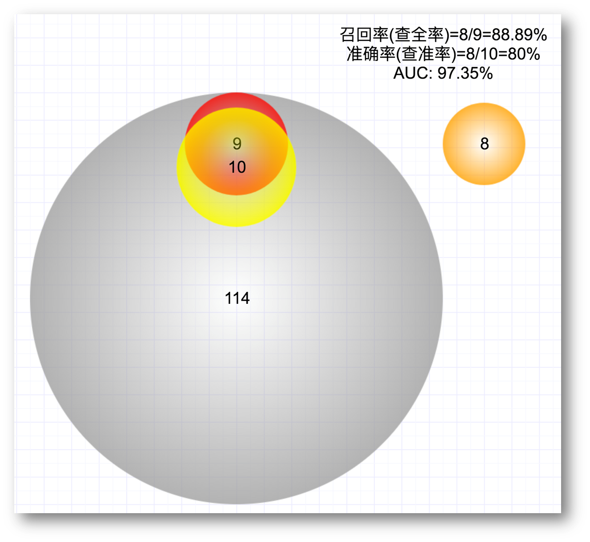
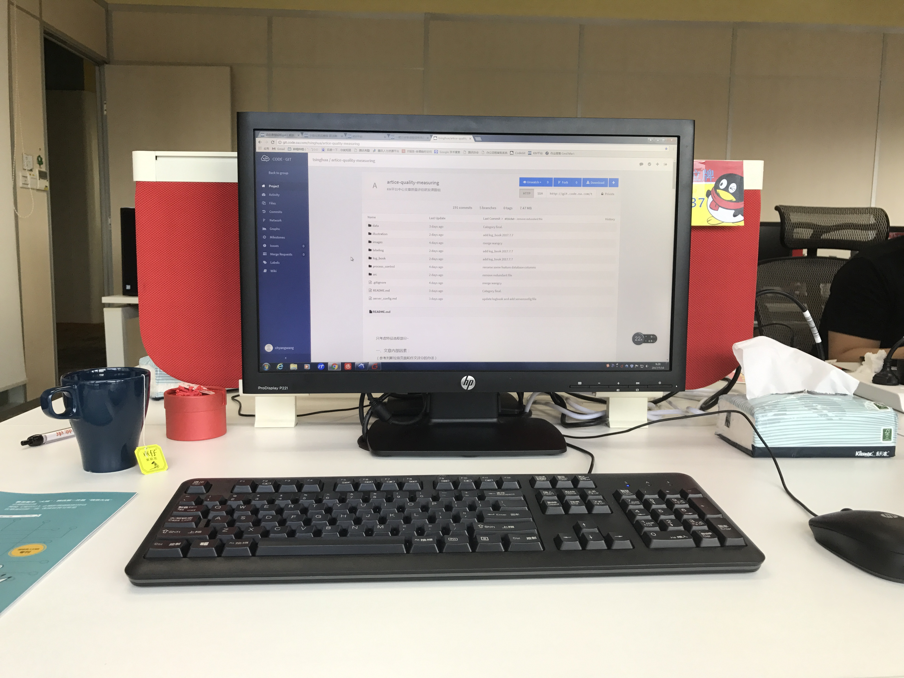
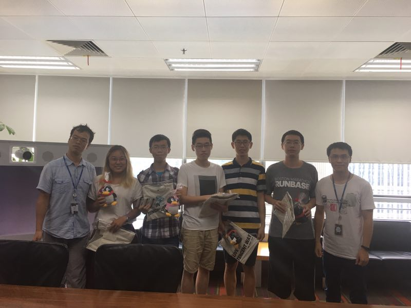

2017最后真正去实习的有腾讯和依图，暑假7月至8月在腾讯实习了一个多月，回北京后上课的同时在依图实习了三个月。这篇文章就总结一下我在两家公司实习时的感受和评价。

### 腾讯

**城市**

这次去的是深圳的腾讯总部，之前并没有来过深圳这座城市，刚下飞机时，最明显的感觉就是湿热，出汗根本下不去，毕竟是南方城市。但这里的蓝天白云以及道路两旁随处可见的热带树给我留下了很好的印象。在这里生活一段时间后，发现除了湿热还有一个很大的缺点是城市规划不合理，尤其是人行道和自行车道交叠，非常不方便。

除却湿热的气候和奇怪的城市规划，其他方面还都是挺满意的。作为一线城市，繁华程度也是没的说的。景点上虽然不多，但也有世界之窗、红树林、深圳大学等可以逛逛；吃的话有牛肉火锅、潮汕砂锅粥、港式早茶等等，尤其是牛肉火锅，非常好吃，吃了很多次，但早茶反倒觉得还不如金鼎轩的好吃；住的酒店条件很好，上下班有班车接送，地铁等公共交通也很是便捷。因此总体来说，对于在这生活的一个多月，虽谈不上喜欢这座城市，但至少是满意的。

**实习内容**

小学期在腾讯的实习和一般的实习还挺不一样，我们更像是几个人一组在这里做一个实际应用的大作业。所做的项目都是新提出的，不是加入到现有的项目组跟着干活。比如我们组要做的课题就是一套文章评估系统，为腾讯内部的知识管理平台KM平台评估每篇新发表文章的得分，以此为依据呈现给小编决定是否推荐或是否头条。以前小编可能要看所有新文章再决定推荐哪些，现在可以只看得分较高的文章，相当于我们做的系统为小编预筛选了一遍。

本来以为会用到NLP的一些知识分析文章内容的质量，但后来我们其实做成了一个机器学习的大作业，就是简单地提取文章特征，然后训练一个分类器去回归文章的得分。所以我们做的主要工作就是选取特征以及调参数。

特征上我们抽取了很多方面的特征，包括格式特征、内容分类特征、作者等外部信息特征。其中内容分类特征并不是天然存在的，我们根据自己的想法手动分了若干类（有些类别是显然不容易被推荐的），然后人工标注了几千篇文章，又单独训练了一个内容分类器来提取内容特征。

有了这些特征，选取合适的模型，经历漫长的调参之后，模型的效果倒也还不错，测试集上小编推荐出来的文章得分普遍很高。用近期某一天发表的114篇文章测试，系统得出得分最高的10篇文章中，有8篇和小编实际推荐的重合（此时小编并没有看系统得分，小编从所有114篇文章中推荐出来了9篇）。因此最后这套系统成功上线使用了，这一点还是挺开心的。

测试效果

系统架构

虽然结果挺好的，但要说在这个项目中学到了什么东西，还真是不多，属于用学过的知识解决这个实际应用问题的项目，使用的方法都比较熟悉。学到的更多是工程上的，比如系统架构设计、团队协作、数据库操作、服务器上线部署等内容，也算有所收获，至少了解了系统是如何上线的，虽然也知道我们这个上线肯定很多流程没有走，属于十分简单的上线了。

另外，我们组没有很粗的大腿，我承担起核心的得分模型实现与调参任务，这个过程让我充分认识到，有时候虽然思路很熟悉并且很简单，但实现出来并得到好的效果是不容易的，花费了很大功夫把整个系统对接起来并调参。另外，答辩的能力在这个实习中也有所锻炼，负责了两次周进度汇报以及最终的项目答辩，学习了prezi的制作，最终答辩效果还是挺满意的，也得到了同组员工和老师们的认可。

**公司氛围**

作为互联网巨头之一，腾讯的公司氛围非常nice。首先各种制度和行政服务上十分完善，从入职到日常工作再到离职，都十分顺利，新人指引很丰富，给人很贴心的感觉。

工作环境非常和谐，每天早上技术组有晨会，并且经常能看到员工间交流问题。

工作的氛围给人以轻松的感觉，大家没有整天紧张兮兮的，每天下午有下午茶时间，休息时也有三五员工聚在一起打王者荣耀。晚上加班的情况也不严重，至少我们所在的部门晚上八点基本就没多少人了。不过这可能只是我们观察到的这段时期的情况，有任务在身时估计也会比较肝。

公司的行政福利也不少，就我们在那里的一个多月，就有两次给所有员工发的福利。日常还有每天8点后加班的夜宵券、堪比公交车的班车分布、每月的生日会等等，楼里医务室、健身房、快递管理、理发等等生活需求也一应俱全。

职级晋升上有明确的等级，比如技术岗T1、T2、T3等，晋升需要答辩审核。

知识管理是每个互联网公司非常重要的一环。腾讯的知识管理平台是KM（Knowledge Management）平台，每个员工都可以在上面发表文章，多为项目的总结或者知识的整理，所发文章的热门程度甚至关系职级晋升。我们做的项目其实就是面向这个平台的，KM平台是我在腾讯最喜欢的，上面经常有很多有意思的文章，可以学到很多小知识。每天到公司先打开KM看一看头条和推荐的文章已经成为腾讯员工的常态。

除了KM平台这样的知识管理平台，还有类似内部知乎的乐问，大家可以在这里聊热点、聊八卦，非常活跃，也有很多有意思的贴，可以供工作之余娱乐用。

 

总的来说，腾讯给我的感觉较为养老，属于不那么拼还能享受到良好的公司福利以及社会名誉的公司。待遇也尚可，进公司后有明确的晋升路线和努力方向。但缺点在于对这样一个大公司，员工众多，很可能自己成为一个螺丝钉，如果一直在底层干更是如此，会成为专精自己所负责的一小方面的人，这对自己的提升是十分有限的。

当然，这些对腾讯的看法自己都不能保证完全合理，毕竟我们实习期间并不算完全融入公司的生活中，只是凭我的观察得出的结论。但说实话我对于这种类型的工作生活还挺满意的，特别是之后稳定下来，希望找个这种不那么拼的大公司安安稳稳地工作。刚毕业的时候倒更偏向于拼一拼。

这一部分最后放一些腾讯实习期间的照片吧：

腾讯总部大厅

工卡

工位

结项合影

世界之窗1

世界之窗2

红树林海滨公园

### 依图

依图的总部在上海，北京有一个分部，就在清华科技园里，倒是非常便捷，学校东门出去就到了。地方不大，只占一栋大厦一层的一半，没有食堂等设施，公司内部的布置倒还不错。

一开始入职时十分懵逼，因为HR好多事情都没交代，什么一周工作时间的要求、工资结算等等细节都需要自己去问。Mentor是个几年前毕业的学长，看起来特别忙（其实这里每个人看起来都很忙），没空带你熟悉公司以及将要使用的内部应用。第一天内部账号的激活还出了点问题，一直登陆不上去，邮箱什么的都用不了。折腾了大概一天吧，遇到什么问题问什么，总算把工作日常要用的东西都搞定了，接下来基本就步入正轨了。

**实习内容**

我进的组是“语音组”，是公司内搞语音识别的，想开发出一套自己的语音识别算法和系统。实习刚开始的时候导师给了一周的时间做内部的Tutorial，内容涉及公司概况介绍、Linux Bash的常见用法、各种语言代码规范、代码提交流程、python使用、深度神经网络入门、tensorflow入门、GPU使用介绍等等。这里不得不提到依图的知识管理体系，主要载体为名叫Confluence的共享文档。依图有一套非常完备的文档机制，在这里可以找到从建立公司到现在各种项目的各种文档，几乎所有的进度控制、项目管理、实验记录、任务分派、项目小结都是通过文档进行的，这些文档整合在一起就构成了Confluence，可以说是依图的知识宝库了。

回到Tutorial上，Tutorial就是文档的一部分，整理得非常详尽，信息量极大，但对新手很友好，只要认真学。对我而言，Linux Bash以及深度神经网络我几乎是零基础开始学习，但通过一周多的高强度学习，我完成了Tutorial的所有内容，对这些不了解的领域也有了初步的认知。每个Tutorial之后还设置有一定难度的习题，导师会进行批改，加强对Tutorial内容的学习与掌握。不得不说，刚进依图的这个Tutorial让我学习到了很多，受益极大，可以说就这个Tutorial，我学到的东西已经比在腾讯多了。

结束了Tutorial，我开始接到正式的活了。这里不像腾讯，这是真正加入一个组帮着干活，要做的工作基本由Mentor安排，Mentor会随时关注你的进度。实习期间也被安排过各种各样的活，有工程上的，比如做了一个优化后每个Batch的时间不稳定了，找找原因做一下加速；有算法上的，比如找找语音识别相关论文，尝试一些深度神经网络的小trick；也有研究上的，比如整理一下近两年语音顶会上关于语音识别的论文；还有数据处理上的…...

总之任务的种类很杂，几乎涉及这个语音识别系统的方方面面，也正是因此，我学习到了很多知识，最大的提升因该是Linux下各种命令行指令的使用以及深度神经网络。还记得要实现神经网络的trick时，为了改一些实现，我把这个系统几乎所有的代码全部阅读了一遍，有些部分甚至看到paddlepaddle底层的C++实现上（系统用paddlepaddle写的），并整理出了系统架构图和数据流图。后来有一次我们这的大boss想看看现在系统的框架，正好我这画了这些图，直接被用来拿给boss看了，还是挺开心的。

虽然在做各种任务时学到了很多，但遗憾的是做的很多工作没有带来识别效果的提升。比如尝试的一些GRU的trick、以及最后下了很大功夫用机器学习方法做的数据集清洗，都反而使识别效果降低了，这点使我有点挫败，到最后没给系统带来实质的提升。不过还是在有的方面做的挺成功的，比如我做的训练加速效果非常明显。

**公司氛围**

这里的公司氛围说实话有点奇怪。一方面是大家都非常拼，依图非常出名的“九九六”工作制，每天9点到21点，一周6天。但我每天9点离开公司一定是技术组最早走了，好多人都到11、12点才走。白天的工作中大家也都非常拼，一直在干活，从来没见有人进行什么娱乐，这使我甚至不敢在工作之余玩会手机或逛会B站，会不由产生一种愧疚感，值得和大家一样拼命干活。

另一方面，这里人与人之间的关系总觉得有点微妙，不像腾讯那么欢乐，也可能是北京这里的大家不是特别平易近人，让人感到有点尴尬，没那么舒服。大家平常聊点也多以公司事务为主，几次和Mentor吃饭都略显尴尬。还记得有一次大boss请我们吃饭，我因为实验室读书会去晚了，刚到的时候听大boss说“给大家讲个八卦”，本来以为有故事听，结果是说依图国外第一单业务落地了…...后来整个饭桌上基本也都是和公司发展、业务相关的话题，我们这些实习生一点插不上话。这和腾讯那边跟boss吃饭完全不同，那里都在聊一些生活琐事，氛围更轻松一些。

公司架构上，其实我没看懂晋升的路线，不像之前在腾讯看到的那么显然，分若干级别等。这里公司总人数少，有几个确定的负责人，然后就是若干组，每组一个组长，其他都是组员，并没有看到固定的机制晋升到组长或者负责人的，估计是看机遇晋升。

公司的行政福利倒还不错，各种生日会、节日会一个不少，感情建设得不错，办公环境也是很nice的。

 

总的来说，依图属于特别拼、工作氛围紧张但提升大、待遇高的创业公司，也许正是由于这种企业文化，依图才在近几年成长迅速，脱颖而出。从公司前景来看依图还是很有发展前途的，实习期间上海的依图总部还搬了新的大厦，工作环境很不错。年轻的时候在这种创业公司多提升提升自己还是可以考虑的，不得不说学到的知识确实很多，还可以在有限的时间内赚更多的钱。但要是长期在这种公司，于我而言有点受不了，不喜欢每天都是这种紧张的氛围。

也放几张依图实习的图：

依图工位

依图生日会

清华科技园

### 总结

最后对在这两家公司的实习情况列表对比一下吧

一句话总结的话，如果想得到提升学东西，去依图这样的创业公司；如果想简历上好看一些，体验大公司氛围，就去腾讯这样的Big Name，体验会好一些。