说起来这个总结已经荒废了好久，大四下的暑假被接踵而至的毕业、实践、科研、军训填得满满当当，结果从大一坚持下来的好习惯被我给丢弃了，而这一断，后面就很难补上了。转眼间就是两年，我也在这期间完成了从一名本科生到博士生的过渡，有很多宝贵的经历和收获，特此按年度总结反思一下；另一个契机是带的年级里有同学看到了之前的那些总结，并表示颇有所获，这让我感到认真总结自己的经验教训是有意义的，不仅能给小同学们提供借鉴，数十年后自己回看也不失为一种乐趣。

2018年是过渡的一年，上半年还是本科生，下半年就正式成为一名双肩挑的博士生了，中间也经历了煎熬的毕设、五味杂陈的毕业、安逸的旅行、以及初为辅导员的手足无措……下面就摘取2018年中让我印象深刻的事件进行梳理，记录下它们带给我的感悟和思考。

---

### 毕设——从第一篇论文到第一篇A类会议论文

说起来大四最后一学期毕设压力还挺大的，既有本专业毕设，又有美双的毕设。**两个项目，两篇论文，双倍的快乐。**但由本专业毕设延伸出了我的第一篇论文，所以这其中过程还是想详细记录一下。

**本专业毕设**

本专业毕设本来定的题目是“用户需求的时间动态性建模”，中间经历了一次改题，更细化到了“**重复消费行为的时间动态性建模**”，借鉴Hawkes随机过程去动态调整用户购买过的商品在当前推荐中的权重，同时用协同过滤去刻画用户的长期偏好，以实现短期需求和长期偏好相结合，可以说是把刚入实验室学到的两种技术结合了一下去解决我提出的问题。

这个想法效果不错，很快就有了成果，所以也应老师要求开始赶5月的CIKM。第一次写国际会议论文还是挺懵的，而且时间很紧，之前粗略的打了个提纲，很不详细，被马哥提了好多意见；准备各种图表和补充论文所需的实验数据也让我感到攒一篇论文真的需要很多心血，特别是画图，精益求精的性格让我有时候一个图能画好几天，总是有改进的想法、总是有不满意的细节。但**真正用心打磨一样东西也让我体验很好**，后来事实也证明这篇论文里的图算是这一版最出彩的部分了。等到准备工作完成，真正开始写的时候都到五一了，时间紧迫，我给自己定的计划是一天一页，十天写完。还记得当时很早就说定了五一和梁去天津玩两天，我们就晚上买一瓶酒回到酒店坐在吧台，我写论文她看“非自然死亡”，也是挺难得的回忆，最终在五一结束后几天顺利完成了初稿的撰写，又经历了老师和师兄的多轮修改，算是顺利投了出去。

写完英文的论文系里的毕业论文就很好写了，对着翻译一下改一改就完成了，最后答辩得分也是实验室同一批里最高的，遗憾的是没有入选优秀毕业论文，不过从现在的眼光来评价确实漏洞百出，后来CIKM也没有中，但当时还觉得信心满满。还记得出结果的那一天，由于时差的原因，通知邮件在凌晨，那一整夜我都没有睡好，只感觉心脏一直怦怦的，隔一段就醒一次、看一眼手机、没有消息、继续尝试睡觉。就这样一直循环到凌晨5、6点，直到拿起手机看到了一个醒目的reject在邮件标题上，说实话那一瞬间没什么感觉，只感觉心跳得更快了。真正让我心碎的是看过reviewer的意见后（记得是-2，-2，-4），**被喷得体无完肤**，更可怕的是很多问题我都觉得很有道理，这让我对这篇工作的意义产生了怀疑，陷入了深深的迷茫。

后来马哥和老师帮我一起分析论文意见给了我一点信心，但还是没找到能说服我自己的改进方案。由于当时正好衔接上AAAI，只改了篇幅和一些边边角角的问题就又投出去了，但这次投我就没抱着能中的心态，只想着能再白嫖几个意见，之后再系统地修改一遍。在投出去的期间我对这篇工作的定位和创新点又进行了详尽的思考，做了很多大面上的改动，比如从声称提出一个框架变成一个模型、强调Hawkes和协同过滤的结合（之前只强调Hawkes刻画动态重复消费需求，协同过滤是附带的）、补充baseline等等，最终形成了一篇至少让我自己十分满意的论文。等AAAI结果出来之后，虽然一如所想没有中，但其中有一个8分（满分10）还是给了我很大的信心，我接着根据意见补充了一些提到的baseline（这里其实有一些心虚，由于改投WWW时间紧，不少baseline只是跑出个合理的结果就写上了，没有细致去调）。一切准备完成后我又一次信心满满地提交了WWW，这一次不知道为什么，觉得一定能中，**有一种各方面都打磨到极致的感觉**。事实也没有让我失望，出结果是临近博一上寒假的某天傍晚，我正在寝室玩DNF，看到侧屏跳出论文被接收的邮件，我甚至没有打开看，压抑不住内心的喜悦，站起来在寝室兴奋地踱了好几圈，坐下来又先给DNF充钱买了个礼包，之后才打开邮件看看是怎么夸的（poster：2，2，-1），再去处理微信上的祝贺，还发了一个矫情的朋友圈。现在回想起来，那种发自内心的喜悦已经好久没有经历过了。

到此第一篇论文的诞生算告一段落，虽然这之后开会的经历很坎坷，由于地点在美国洛杉矶，签证屡次被拒，最终也没能成功参会，但这毕竟是我的第一篇论文（也是目前唯一一篇QAQ），这段经历还是十分值得详细记录下来的，师兄从会场带回来的WWW 2019纪念背包我到现在也还一直用着。它让我认识到只要创新点合理（相比之前模型核心不变，换了个说法就收到很好效果）、实验尽可能充分，中论文并没有那么难，也使我对之后的研究又充满了信心。

**美双毕设**

至于美双的毕设，我们根据所匹配导师的**孔子博物馆交互设计**大主题，做了一个基于手势识别的项目，通过小游戏反映论语中的经典语录，比如用手模拟砍树和磨刀，寓意“磨刀不误砍柴工”等等。具体就不细说了，开发过程困难重重，和队友纯自学Unity，对接手势识别用的leap motion，在逻辑处理和边缘检测等细节方面遇到了很多坑，最终完成度只能说差强人意吧。

值得一提的是美双毕设还涉及到布展，需要把设计作品放在展厅公开展览一周，这对于我们也是挺大的挑战：设计展板、做宣传视频、现场布置、通过各种途径借足够的leap motion与surface供游玩......最后弄下来也是精疲力尽，虽然和其他优秀的组比起来能看到比较明显的差距，而且最终答辩成绩只能算中等甚至还靠后，但对于我们这几个外行来说可以说是人人尽力了，并且很享受中间的过程：在拾年咖啡讨论、在C楼科协活动室爆肝、还有队友因为肝作品和女朋友吵架......最终看到有同学来展厅玩我们的作品，并表示挺有意思，还是颇有成就感的。

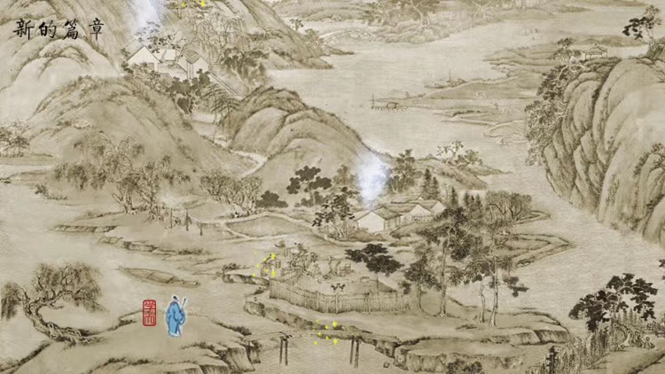

美双毕设界面

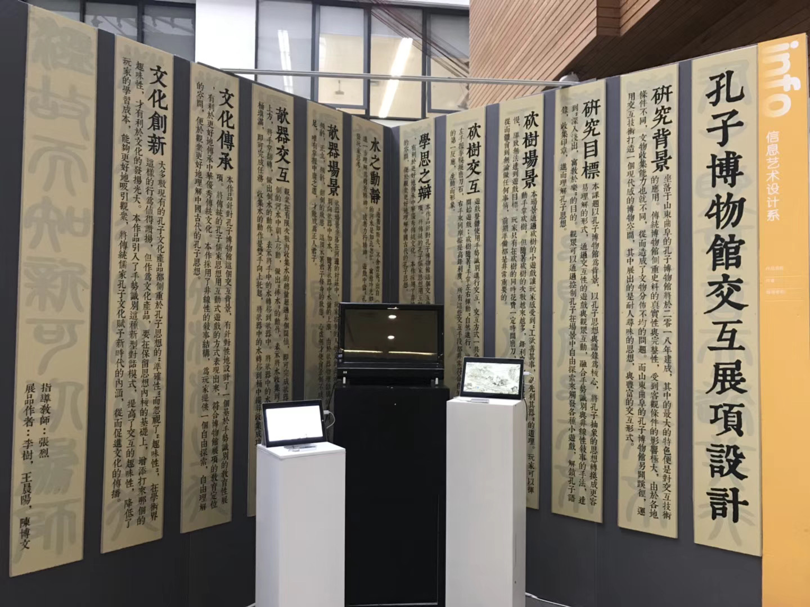

美双毕设展位

---

### 毕业——五味杂陈

毕设之后紧接着就是毕业了，一切都来得那么快，毕业手续、毕联、毕业照、毕业典礼、退宿、搬寝室一件接着一件：还记得毕设答辩时从容不迫、音落铃响；还记得拍毕业照时翻出落灰的西装，拿出发胶打理头发；还记得毕联负责物资在后台边忙边笑，晚上聚餐在满盆乡边喝边哭；还记得最后的寝室聚餐，四人分别走上不同的道路，相继离开生活了四年的411B；还记得全校毕业典礼上优秀毕业生出现我的名字，爸妈骄傲的眼神；还记得和梁拍两校毕业照时露出两排大牙的傻笑......

还有很多很多，在那个**不那么热，却令人难忘的夏天**。

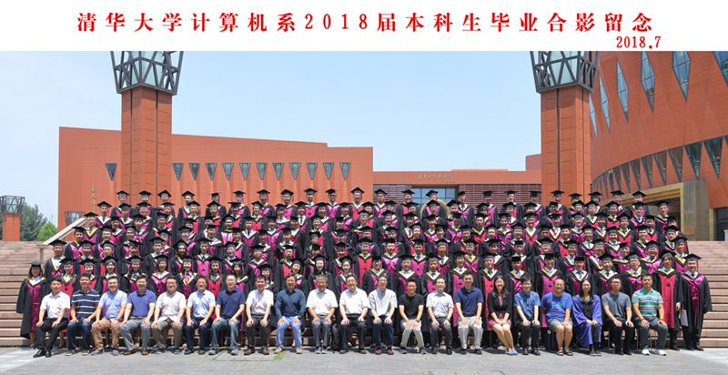

官方毕业照

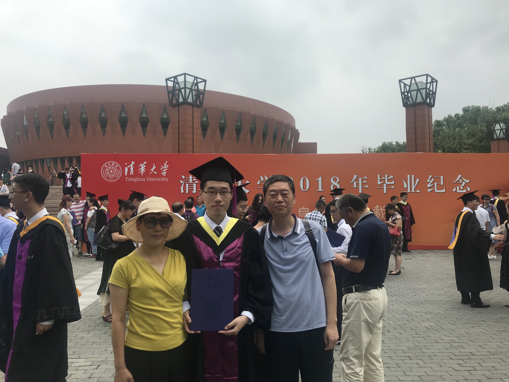

和爸妈参加毕业典礼

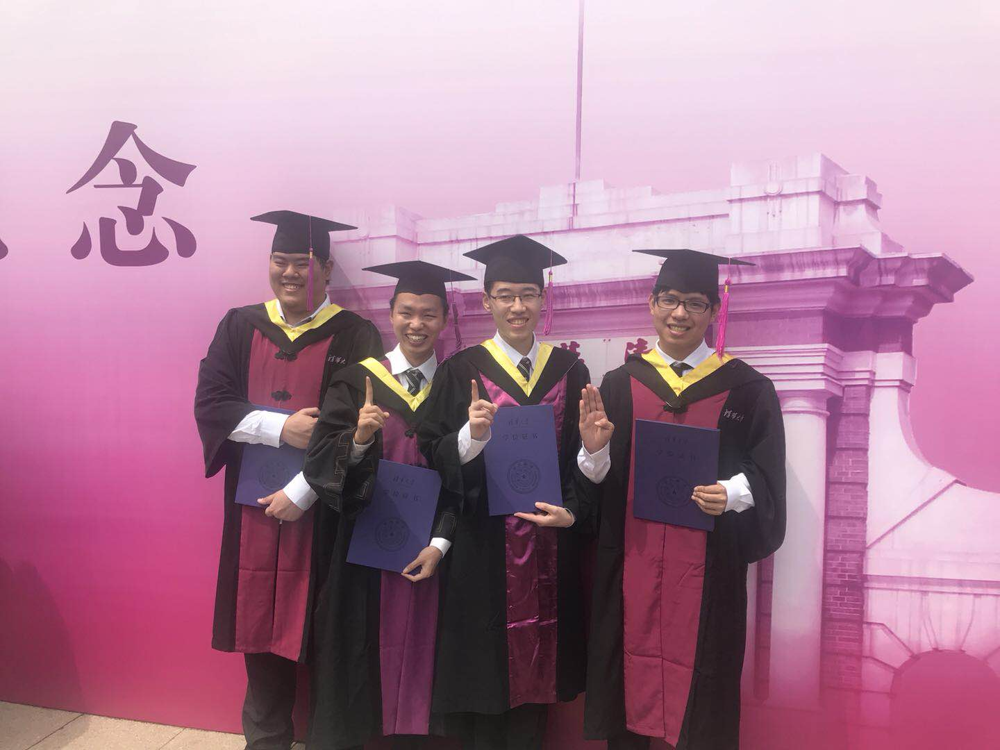

411B寝室合照

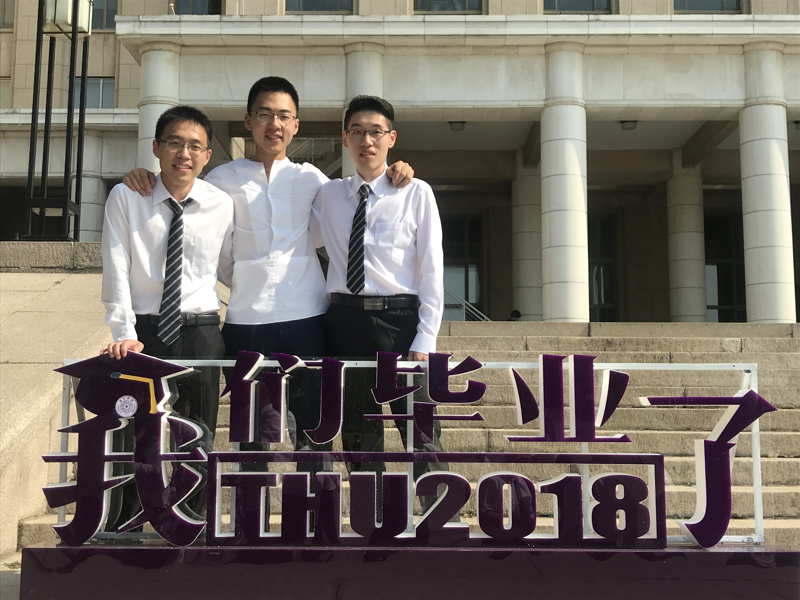

辛师傅和白教员

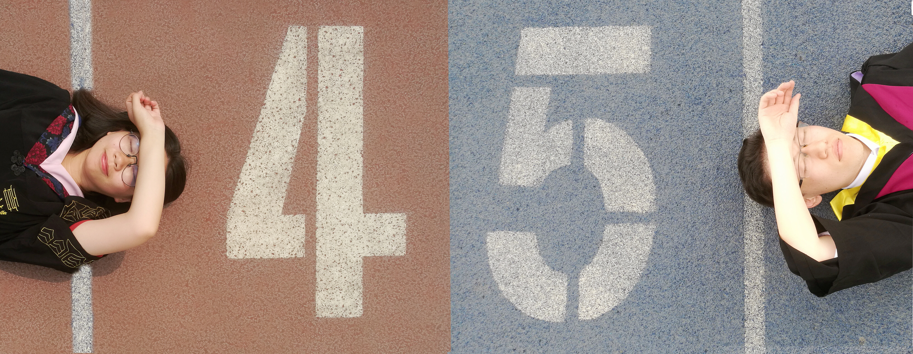

清北两校毕业照

这一切感受都在我搬入108B之后慢慢沉淀下来，回头想想，令我感到后怕的是，竟也没有什么特别不能割舍的，只是想到已经告别了能一起联机打游戏到3点的室友、告别了已经适应并擅长的课程教学模式、告别了一票熟络但又不那么交心的朋友，会有一丝感伤。说到这要反思一下自己的性格特点，看似跟很多人都很聊得来，但真正的朋友没有几个，确实不太会花心思关心别人，难免表现出一副外热内冷的样子。感觉自己是一个挺矛盾的人，曾经以为内心里还是更喜欢一个人吃饭、一个人娱乐，喜欢一个不需要花心思跟人交流的环境。但搬完寝室那几天真正做到了，周围只有自己一个人，又觉得少了点什么，甚至以前室友令我有点不自在的观战游戏指指点点，现在也觉得美好起来；类似的还有梁天天粘我的时候嫌烦，想专心打游戏，到后来不怎么发消息了又觉得缺乏安全感，殊不知现在的一切都有其因。**我总想着如何让自己的事情完美、无可挑剔，却忽视了人际关系也是需要维护的**。这一点当时只有一丝萌芽，随着我当辅导员、随着跟梁发生的几次矛盾在我脑海中越发明晰。我想之后我会投入更多的精力平衡自身发展和人际交往间的关系，展示真实的自己，多认识一些人，也多交一些交心的朋友。

---

### 课程——尽力而为

研究生第一学期课程压力也是不小的，一般来说，我们都会在两到三个学期把要修的学分修完，越早修完就意味着能越早专心投入到科研中。第一学期我选了6门课，包括2门久违的数学课、2门专业课、还有英语课和思政课。整体来说压力不算大也不算小，最重要的是让我又找回了上课肝作业的感觉，毕竟大四一整年都基本没课，还是挺怀念的，所以自认也是有很认真地对待这几门课。下面对每门课简单回顾一下：

- **组合数学 [A-]**

这是一门挺有意思的课，内容涵盖排列组合、母函数、容斥原理、旋转群、还有一点线性规划的知识。重点是马昱春老师讲课很有意思，充分利用了雨课堂这一新型教学形式，在线签到、答题，还有弹幕。内容不算特别难，马老师都能用比较通俗的语言深入浅出地讲解。作业内容也非常丰富，既有书面作业，又有小论文，还有编程作业。总体上学下来还是挺愉快的，也学到了不少东西，很多感觉都是公司技术面试时可能涉及到的问题，记得很清楚其中一个队列恢复的问题就是我当时Google面试最后不会的那道题，可惜没早学这门课。最后考试的话我们那几年出得很难，考前两天我们早餐群的几个一起在北馆复习（还记得午休在新开的音乐图书馆听”念诗之王“），我说我要是卷面能考80就谢天谢地了，结果最后真考了80整，除了特别难的一题和一点小失误外其他分都拿到了。总的来说还是体验很不错的一门课，虽然也经常被大家称为数学课组里最水的一门课。

- **最优化方法 [B]**

这门课是我最不服的一门，它是一门数学硬课，有点像大一线代微积分的综合加强版，还有更深的凸优化理论和知识。这门课平时只有一些书面作业，期末考试是大头。听说去年我们实验室的学长们得分都很低，最高的总评才拿了C+，所以我从一开始就很认真在学，认真做每次作业，期末也是提前一个月就待在图书馆整理笔记+刷题。到最后可以说是把整本书的知识点几乎烂熟于心，题也基本把能做的都做了。考前是跟佳姐从实验室出发的，郑导说我们现在看起来就是两个最优化题库，男题库和女题库hhh 拿到卷子看到大题有原题，信心更是大增，一气呵成没遇到什么大的困难就把题全解完了，出考场的时候我甚至觉得不出意外能考100，总评怎么也得有A吧。结果最后给了个B，开学也查过卷，没让看卷子，只说没问题，因此至今不知道为什么得分如此低，极大地拉了研究生绩点。不过也还好，至少我很享受复习最优化整理知识点和刷题的过程，把科研和社工都放一边，专注在一件事上，就像回到了大一的自己，十分怀念。

- **计算语言学 [A-]**

孙茂松老师讲的NLP相关的专业课，一看课件就是上古时代的了，方法也大多比较老，很多是基于一些统计量发现词语搭配等pattern。上课总觉得老师讲了很多无关的东西，后来也没怎么听了。我们这届没有考试没有大作业，只有很多次需要写报告的小作业，我还是挺擅长这种做一个小项目再加报告总结的模式的，每次都十分认真，得分也都比较高，最后一次涉及到深度学习方法的还被选为优秀作业在课上展示。总体来说中规中矩的一门课，说实话没有学到很多东西，得分也是一般，感觉仅通过若干次作业也区分度不大。

- **数据挖掘：原理与算法 [A-]**

本学期最无聊的一门课，老师上课就是祖传ppt+念课件，方法也都是数据挖掘领域传统算法。很多同学都是奔着课程名选的，而到后来就没多少人上课了。抛开平时类似聚类分析的一些编程作业，主要有一个再入院预测的大作业和期末考试。大作业有点类似本科机器学习概论的大作业，一个标准的机器学习任务，看最终谁的效果好。这个大作业其实收获挺大的，都是同样的数据同样的任务，我们组尝试了各种模型和trick，最后结果还是和最好的组差不少，答辩结束后问其他组要了报告仔细研读，发现有时候特征的选择和再处理真的很重要，远比模型重要的多。至于最后的考试，则是我经历过最儿戏的，开卷而且不隔行不隔列，考场上的交流此起彼伏，老师开始考试是说的那句”大家独立答题“都显得那么没有底气。我们也是提早就知道了这种情况，事先加了好多考试的交流群，考试当天提前占位坐到一起，最后除了一两道有争议的题，其他答案都是一样的，得分也都是中规中矩。我甚至在考试前还过了一遍ppt，事后感觉真没必要，考场上现找就完全可以。总的来说是这学期收获最小的一门课。

- **自然辩证法概论 [B+]**

思政课我向来没得过高分，但我真的感觉我有努力在这方面提高自己，但如果现在要我回忆上课讲了什么，确实回忆不起来。主要评分方式是最后的论文，我在寝室打磨了两天，是关于人工智能和社会带来的思考，但可能深度还是有欠缺，最终得分比较一般。

- **博士生英语 [A-]**

英语课上得十分安逸，主要讲的是学术论文写作和poster展示，有一些日常用语和学术用语的相互转换使我受益良多。老师是国内老师，人很nice，觉得大家听不懂还会用中文补充几句，所以上课理解上完全没有问题。此外还认识了美院一个很精致的小哥哥，跟他一组平时也经常有交流。学期中的主要任务是形成自己的一篇论文，因为有之前那篇CIKM的底稿在，每次修改修改就交上去了，同组成员间会互相修改。最后的pre是单人自选题，我的展示效果还挺不错，最后受欢迎投票得了第二，可惜只有第一名有奖品，有点遗憾。但总的来说这门课体验很好，也学到了一些东西，认识了新的朋友，好评。

---

### 社工——初为辅导员的手足无措

**新生骨干训练营**

进入辅导员这个角色是从暑假的新生骨干训练营开始的，那时我作为大导带全校港澳台的同学，也会负责组织我们的骨干进行系内的交流活动。这个过程让我深深感受到了港澳台学生的不同，那种**活力以及展示自己的勇气**，是我很少在内地学生中看到的，而且大多数都十分优秀，着实令我佩服。

另外有一点让我印象深刻的是，有很多优秀的港澳台同学都清楚地知道**自己喜欢什么，自己要什么**，和大多数我们的同学完全不同，这一点在后续的辅导员生活中进一步得到印证。有同学热衷计算机网络、有同学在音乐、游戏上很有天赋，他们会给自己制定发展方向，不认同多数学生不考虑未来发展，随大流只追求的GPA的态度。他们会根据自己的发展计划向你寻求相应的资源，这一点十分值得我们学习。

这个阶段也让我深刻感受到了自己能力的很多不足，不管是在调动气氛、思想引导还是总结发言上，都出过糗。我总是事前规划得很详细，真正上场就会紧张表现不好，之后就破罐破摔了。印象最深的是第一天晚上给港澳台同学讲团队建设，讲了没多少中间构思的内容想不起来了，气势一下没了，跳过了好多直接到了结尾，结果不仅很简短，而且没啥逻辑，最后跟同学的互动还没互动起来，十分尴尬。但除了个别情况外，其实大多数地方还是做的不错的，而且能让大家看出我的用心。中间有一次帮宣传的同学改推送到凌晨3点，后来团建打UNO时那个女生说了一句：”**在香港辅导员一般被称为组爸，而你是我见过最好的组爸。**“之后军训院系篮球赛时，因为剃了头带了个帽子，路过他们院系还看到她在喊：”王导看看你的新发型！“回想起来真的让我十分感动。

港澳台营A班

港澳台营B班

**正式开始的辅导员生活**

真正成为辅导员则是从接过学校聘书开始的，那**一份薄薄的纸承载的是沉甸甸的责任**。接过聘书当晚我发了个朋友圈：”踏歌长行，梦想永在“，以此勉励自己。紧接着，诸多回忆拼凑成了我的辅导员生活：

报到那天炎热的网球场，见到了每一个报到同学对未来的憧憬；中间晓涵骑着电动带我去校医院拿尿检管；发现晚上必须要开年级会紧急安排小导借教室；傍晚一边在基本没人的网球场扒拉着外卖牛肉饭，一边改晚上年级会的ppt；晚上跟大家第一次见面，顺利跟大家讲了话，没有像新生骨干营那样出糗，开心！

第一次年级会

军训，剃了9mm军训头，再次回味自己光头的形象，也是传承我们辅导员在我们军训时剃头的光荣传统，结果后来发现全校基本没辅导员跟学生一起剃头的，但也不后悔；每天端着相机给孩子们拍照，有时疯狂放大看同学们胸牌认人，虽然最后也没认全，很是自责；雨天中的拉练，推了个自行车以备不时之需，最后车锈了，手机听筒也淋坏了，但路上跟同学一起边走边聊边唱很开心；篮球赛训练拍出了很有意境的照片，苦练罚篮但最后并没有派上用场哈哈，导员罚篮环节三连长上了；晚上篮球场加训却没有灯，大家开始围坐在一起，被起哄给大家唱歌；大家骑车带拉练后感冒发烧的同学去校医院，来回多次，嘴上说着没事，实际累个半死，但后来听到他在班级风采展示提到对王导的感谢，一切都值了！

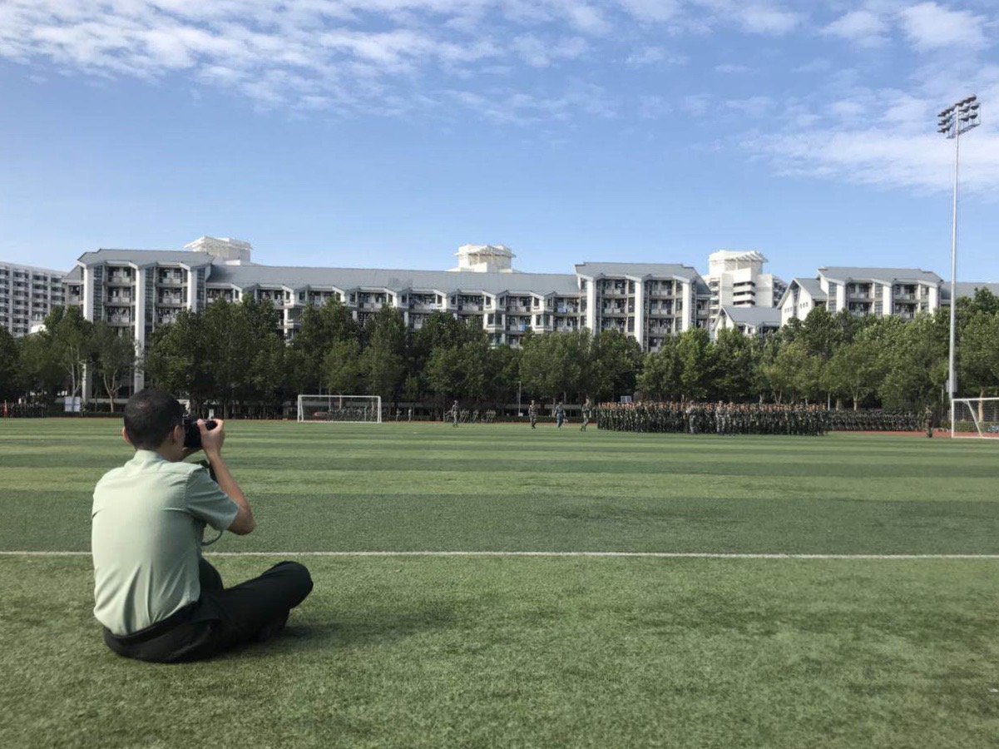

给军训中同学们拍照

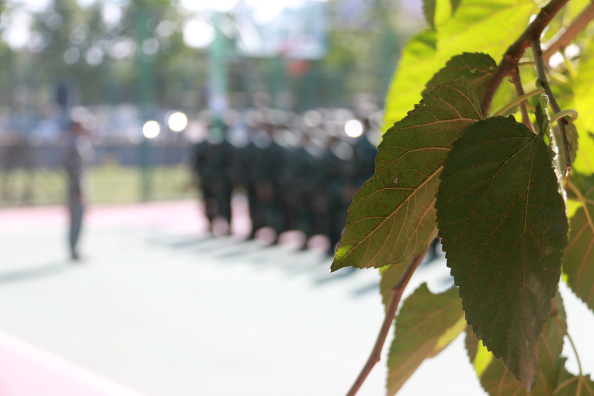

烈日下的训练

打靶合照

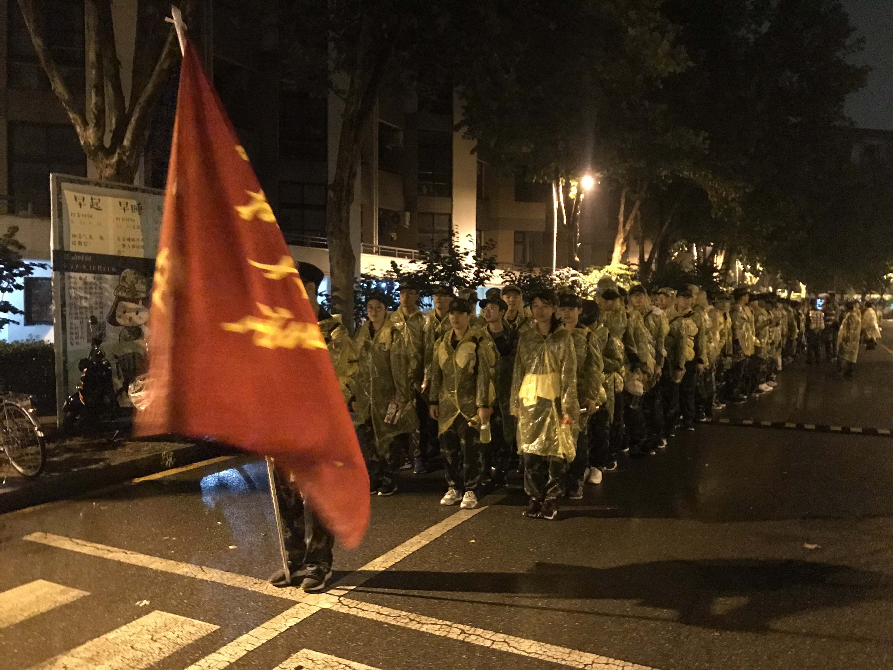

雨夜拉练

学期中，第一次叫同学聊天做了半天的心理建设，没有话题怎么办；同学们怎么这么多问题，我咋啥也不知道；团日总结说啥，大家说的都挺好的；同学约饭聊出国情况，赶紧问之前同学取经；有些事情没什么建议和想法，怎么装得胸有成竹的样子；发邮件问老师要第一学期数学课期中考试成绩，为啥现在数学课老师这么多，还有个外教喷我？？？有同学成绩有危机，赶紧约饭聊聊啥情况......

越写越觉得辅导员这边的回忆太多了，根本列不完。但不管哪方面，最让我感动的还是真正给同学提供了帮助，同学表示感谢的时候，正是这些时刻支持着我继续做下去。同时在这个过程中也认识到自己有不少并不达标辅导员要求的地方，比如不喜欢说场面话，对热点事件也没有什么思考，然而作为辅导员经常需要说这种话；再比如我很少主动去做增量的工作，除了策划图书馆打卡活动，其他大多都是按部就班来，剩下时间去做自己的事情。归结来看一方面是自己的**输入和思考不足**，还是需要更多**了解多领域的知识并形成自己的想法**，但这方面不是一朝一夕能改变的，能感到现在已经有所进步；另一方面是热情和投入还不够，还是要合理安排好时间，做到科研、学习、社工互相补足，而不是互相影响，完成一方面的事之后尽快投入另一方面，减少中间通过休息娱乐自我麻痹的时间。

---

### 旅行——忙里偷闲的安逸

虽然科研、课程、社工占据了生活中的大多时间，这一年还是借着实践、开会等机会去了不少地方旅行。暑假时带队去了新加坡实践，下半年代替已经工作的童皓玥去桂林开CCIR，年底和梁忙里偷闲趁周末去香港转了一圈。

**新加坡**

新加坡实践那个时候是最惬意的，刚结束毕业的一堆事，论文也投出去了，没有任何心理压力，可以说是玩得很开心了。七天的实践有一半在玩，夜游鱼尾狮公园、登上”空中花园“金沙酒店、游乐于环球影城、感受圣淘沙海滩、滑不够的Luge、惊艳的”时光之翼“创意演出；一半在调研，去了新加坡国立大学、南洋理工大学、当地打车公司Grab等等，幸运的是那边的研究方向和我们还是一致的，学到了不少前沿知识。

新加坡给我最大的印象是闲适以及与自然的结合，不仅是校园中有树木贯穿的教学楼，宿舍区和城市街道也高低起伏，随地势和植被层次错落。我最享受的是其中某一天坐在圣淘沙海滩边的长椅上看日落，那种**放空一切的感觉**，什么都不想，就那样看着无垠的海天交界处，如果不是时间不允许，我甚至能在那里坐上一整天。

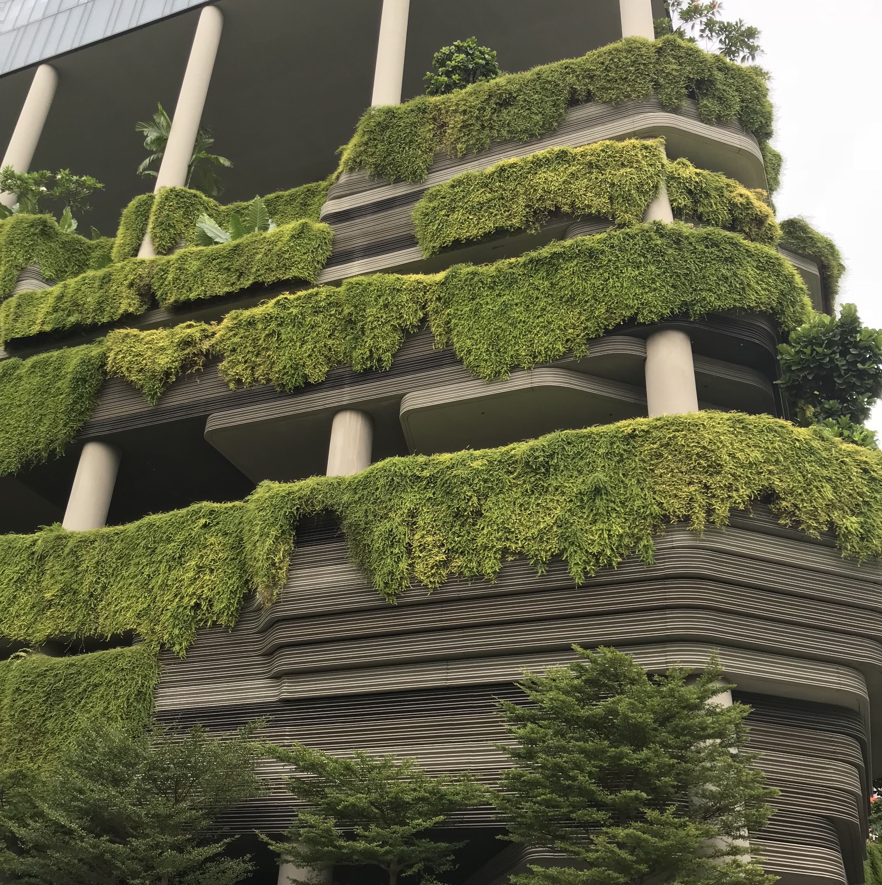

南洋理工教学楼

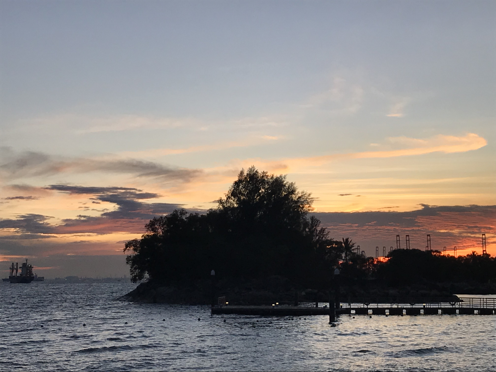

圣淘沙落日

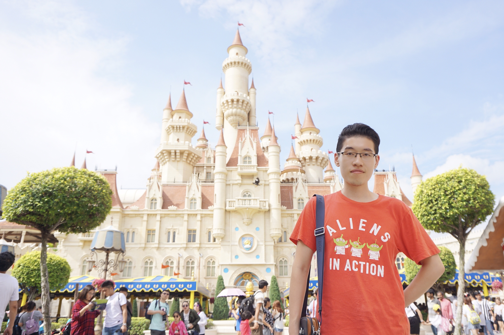

环球影城

**桂林**

去桂林开CCIR其实主要是帮童皓玥做一个口头报告。虽然不是自己的工作，但毕竟是第一次在学术会议上作报告，事前练了很多次，所以最终效果还挺不错的，观众提的问题也能对答如流。唯一比较尴尬的一点是其他人都是英文ppt，而童姐给我的是中文的哈哈。最后虽然没夺得最佳论文，但也荣获为数不多的优秀学生论文，还是挺开心的。

由于在桂林待的天数不多，也没有多少时间去游玩，和英玮偷跑出来一天去了一个桂林山水的一日游团，坐电动竹筏见到了20元人民币的背景；另外印象深刻的是这里的米粉，吃了两次，有一次甚至冒雨也要来吃，正宗的桂林米粉，特别是里面的腐竹，着实好吃。

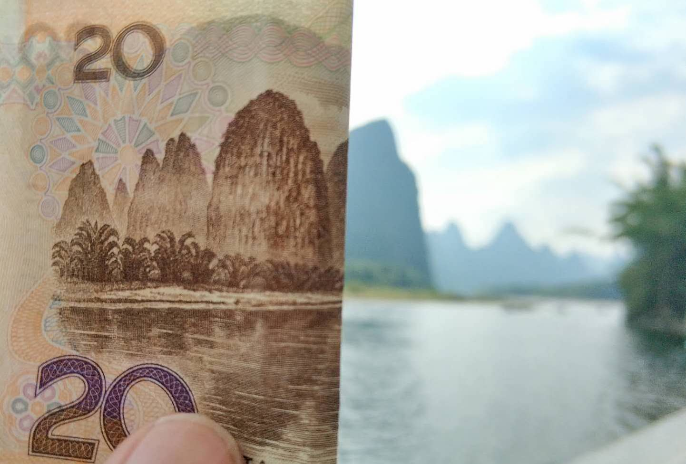

环球影城

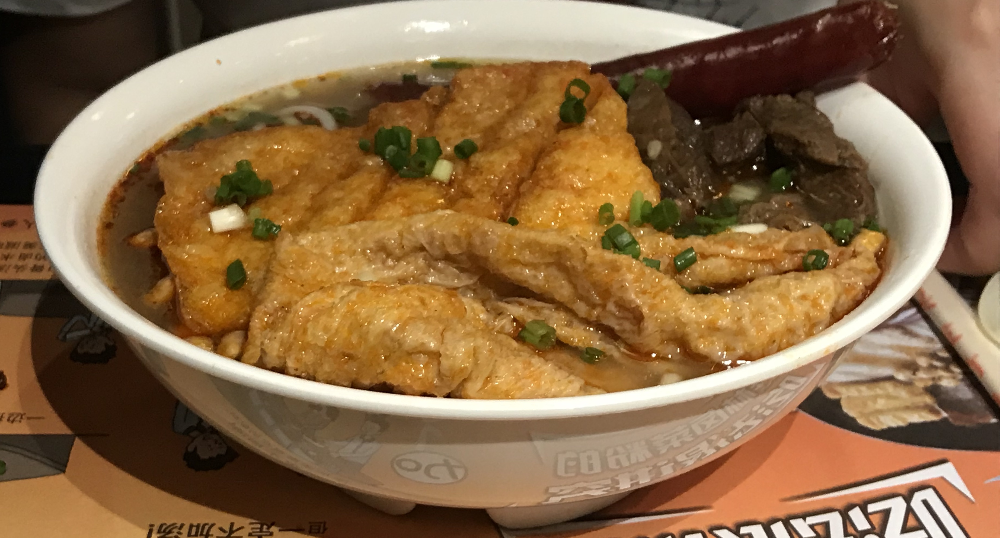

桂林米粉

**香港**

年底的香港则是和梁很早就计划的一次纯玩之旅，也是来找她的一个姐妹。现在看香港的局势，当时去一趟真的太明智了，近几年怕不是都去不了了。香港的住宿真的太贵了，一晚1000起，我们为了穷游做了好多攻略，先飞深圳住一晚再走口岸到香港，以实现在香港只住一晚。至于游玩的内容，虽然只有两个白天的时间，但还是体验很不错，不管是吃的还是景点：澳洲牛奶公司的炒蛋多士、谭仔三哥米线让我们回味无穷，太平山的夜景和港岛的繁华也让我们流连忘返。而且由于住在九龙，晚上也见到所谓的”乱“是什么样的，摩肩接踵地挤过被各种成人用品以及其他杂七杂八的流动摊位占领的狭窄街道，最后豁然开朗回到酒店，也是一种别开生面的体验。

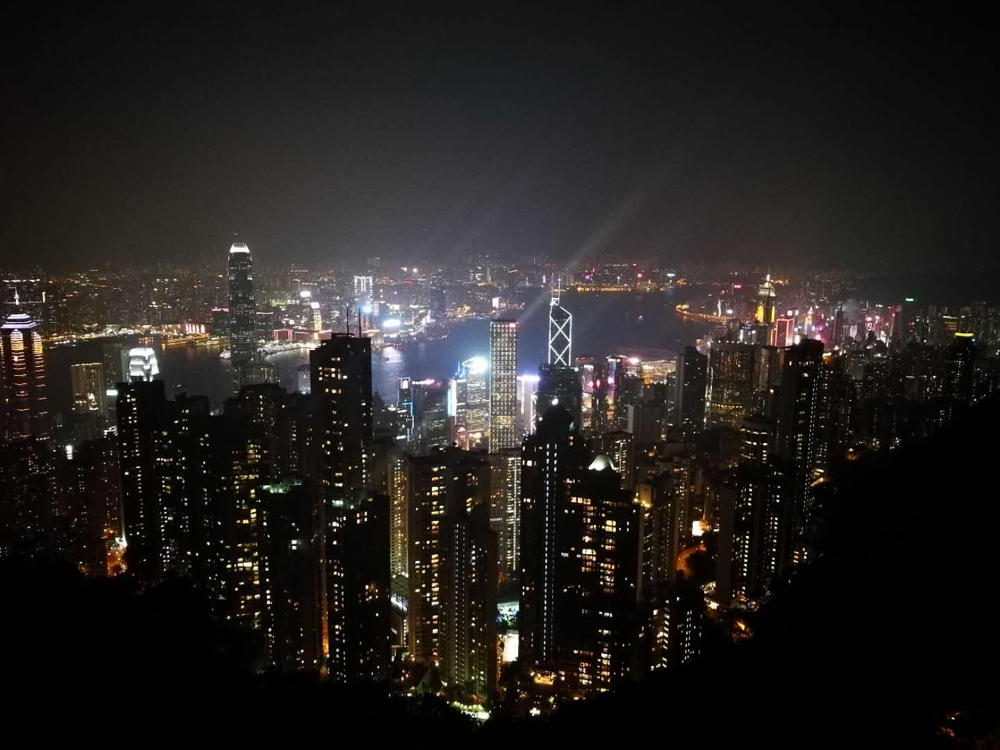

太平山顶

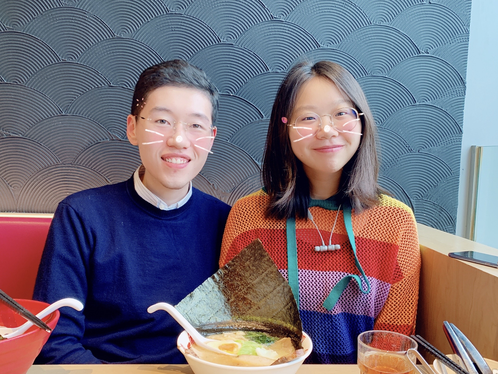

港岛某家一风堂

---

### 杂

除了以上提到的重要事件，还有一些小的事情也记录一下：

大四还被团委书记拉去担任了综合口的副书记，下学期主要负责**视窗计划**的招募和培养，我负责这届在请嘉宾上有不少突破，从以前基本都是系里请，扩展到了校级的嘉宾。但不足的地方在于我跟嘉宾对接地感觉不是很到位，有时候按当时的资金观念酬劳定得也不太科学；另外视窗的社会实践开展没有那么好，我也没有投入太多的精力去关注。

研究生入学第一次班会时被起哄成了班里的**团支书**，其实非常不想当的，本身就是辅导员抽不出精力再负责这边的事情了，但无奈当时也不好拒绝，最后还是按部就班地处理了一些团籍信息注册、团费收缴、主题团日等事务性工作。另外第一学期还参加了**研究生一二·九**，说实话研究生这边组织得比我们本科时候要差远了，大家本身参与度不高，请的老师也不是很靠谱的样子，最后自然是什么奖都没拿到，也没有通过这个活动认识其他同学，其实挺后悔参加的，唯一的乐趣就是又回忆了一遍自己带妆红脸蛋的样子。当时我也下定决心要把明年带的本科生一二·九办得有声有色。

生活上最满意的就是布置寝室了，在新的寝室把桌面好好规划了一下，娱乐环境和质量拉满。游戏方面还沉浸于DNF，已经又走上版本前列，开始打造小号了。但同时又开始觉得累了，打团像完成工作一样，也没有太大的成就感，估计很快会弃掉它了。另外寝室购置了新的电钢琴，抛弃了原来的电子琴，虽然买回来之后发现手感还是不尽理想，但比以前软软的键盘要好不少了，之后要保持练琴的进度，争取每年都学会新曲子。

---

### 总结

总的来说，这一年是被科研、课程、社工三分天下的一年，每个方面都投入了颇多的精力。同时也是非常丰富的一年，本来想两年的总结合成一篇来写的，没想到这一年的经历就写成了万字的流水账。但详细记录的这些确实都是给我留下深刻印象的，也由此引发我的所思所想。相比之前的总结，这篇开始可能多了些反思，我觉得这是一件好事，并不需要只在这里展现出自己好的一面，及时反思、及时止损也是生活的智慧，也希望能给后来的同学们直接的一些启示。那么我的2018年就是这样了，我们2019年，再见！