2019对于我来说是兵荒马乱的一年，也许是刚刚进入新的学习生活模式还不适应，没有找到适合自己的节奏；也许是自己真的没有之前那么努力了。现在站在2020回望2019，没有之前总结时成就感满满的感觉，想到的反倒都是失败的辛酸。这样说也许有点负能量了，但也正好借此机会总结反思一下，努力调整好精神状态。

---

### 科研——屡屡碰壁

还是先从本职工作科研谈起吧，毕设那篇工作中了WWW之后，这一年我又开展并完成了两个工作。说实话，这**两篇工作我都不是十分满意**，第一个是在原来基础上进行的改进，出发点很好但技术手段有点incremental，值得一提的是模型名，刚开始叫Trio，后来改成Chorus，意为目标商品作为多种角色时一起发挥不同作用，一改现在泛滥的首字母取名法，这一点我非常满意；第二个则是在一个新兴领域应用Hawkes，率先占坑，不过也是因为Hawkes确实太适合这个场景了，当时才想尝试一下，没想到效果确实不错。

**第一个工作**

第一个工作年中就有了主实验结果，效果显著，于是在老师的建议下13天赶完了CIKM。考虑到CIKM是B类会议，其实我当时觉得还是挺稳的，但结果还是不尽人意，通知结果那天我迟迟没有收到邮件，后来从导师那里得知我这篇还在讨论，一直到很晚我才收到，还是拒了（1，1，-1）。meta review里面都写了要在camera ready版本中改哪些，可以看出本来是accept的，可能最后又讨论拒掉了，非常遗憾。

后来又紧接改投了WSDM，可惜还是没中，同样也是borderline的分（1，-1，-1），主要问题还是和之前那篇比较像，虽然结果更好但技术上创新不足。当时由于主要精力都放在第二个工作上了，这篇也没再像之前那样大刀阔斧去改，抱着总会中的心态，加了些和以前工作的区别和一个补充实验就又改投WWW了。本来想着这次总该中了吧，结果还是没中，也是borderline的说法，可录可不录。

**遭遇三连拒**让我心都碎了，甚至自己也觉得这篇工作的novelty有点太低了。痛定思痛，这半年来也积累了一些改进的想法，目前打算在此基础上设计一个统一的模型，能涵盖去年已发表的那篇和这个工作。但由于WWW正好接上SIGIR，所以还是简单改了一下投出去碰碰运气。

**第二个工作**

第二个工作年末才有结果，topic挺有趣的，根据学生之前的做题序列建模当前知识状态，知识状态则通过预测题目正误来体现，属于大家喜欢的新场景新任务。第一个投的是WWW，今年WWW的非COI track第一次有了rebuttal环节，当时看到分是（1，1，-1），而且没提什么硬伤，感觉有戏。最令我吃惊的是给-1的那个low confidence的reviewer给我挑了几十个语法错误，我承认改论文改得有点匆忙没太注意，但这也有点太狠了，其他意见提得也都不在点上，另外两个1分的倒是给了比较中肯的意见。为此我精心补充实验准备rebuttal，想要扳回-1的那个reviewer，可惜最后还是没起到作用，仍然给拒了。

不过这篇我并不是很担心，目前准备改投KDD，趁这段时间补充了其他数据集和baseline，整体虽然模型创新性不强，但毕竟是这个领域第一个应用Hawkes的，而且如此契合，从之前reviewer的意见来看继续投还是很有可能中的。

**反思**

虽然这两个工作现在都投出去了而且有后续改进计划，但目前做的工作还是让我觉得**有点背离最初想做科研的初衷**。一方面这些工作的创新性着实不高，我清楚地知道它们并不能给行业带来什么改变甚至大的影响，然而还是要花费很多精力来打磨；另一方面我觉得自己的思想被组里的科研环境束缚了，**一年来并没有学到什么新东西**，还是在用入组就学到的一些知识拼拼凑凑，拼出好的结果，看到问题也会不由自主地往对应方法上去想，完全不会有突破性的想法，每次想到这一点都让我觉得后怕，我觉得**这不是一个研究者应有的状态**。

归根到底我认为还是**来自各领域的输入太少了**，我们做实验越来越多，读论文越来越少，即使读也是读自己这个领域的，而领域内常见的方法就那么多，每次看总觉得很熟悉，都是一个套路，看起来也不会很认真，觉得自己都了解了。基于此我准备从以下几个方面着手做出改变：

- 首先多读各领域的前沿文章，通过paper weekly等平台给自己制定阅读任务，保证自己的充电频率；
- 其次多和组外的同学交流，不是泛泛地谈，而是具体到用什么方法，以此拓展自己思想的边界；
- 另外要勇于做暂时看不到解决方法的topic，**解决现在看似不可能的问题才是做研究**。

特别是最后一点，很多人会拿着最近流行的新模型去找在哪些领域还没有被应用，以此确定topic；我之前也总是希望拿到一个项目就希望能想到一个方法，并且大概率这个方法能work，也正因如此，我做的看起来都很像是incremental或者yet another application的工作。类似这种确定topic的策略，甚至在写代码之前就能想到一定会有效果，但这是做研究吗？不，这是工程师该干的事情。所以我现在在努力转变这个观念，**从“我能做什么”到“我要做什么”，多从实际研究中遇到的棘手问题出发去找topic，尝试体验从未知到摸索到解决的过程**。当前正在做的“中学生综合素质评价”项目就是这样，它很难，而且暂时没有什么办法解决，但它很有意义，我想我会坚持下去的。

---

### 课程——划上句号

坦诚地说，在诸事不顺的2019年，课程学习算是带给我很大慰藉的一件事了，通过投入学习来缓解其他方面的不顺心。这一年的两个学期我也都有选课，博一下相比博一上专业课增多了，曾经有一段时间4门课都有还未结的大作业，再加上两个科研工作，服务器有6个tmux窗口，那段时间真的是写代码写到爽；博二上在培养方案仅差1学分的情况下，为了挑战自己，选了4学分的数学硬课“应用随机过程”。下面还是分科目梳理一下每门课的感受：

- **人工智能原理 [A]**

这门课是前八周每周两节的课，感觉朱晓燕老师并不是特别紧跟技术潮流，课程内容有点太基础了，所以后来也没怎么听课。考核上有几次需要写报告的小作业，大作业是小组自选题做实验写一个小论文。当时正好从当助教布置的课题中汲取灵感，就提了一个选题，也理所应当成了小组内主要负责实现的人。最后来看效果还不错，虽然还达不到扩展成一篇国际会议论文的高度，但课程答辩还是挺出彩的。而且没想到这门课的助教是我在新加坡交流过的一个学长，多种因素叠加导致最后成绩还是不错的，总体来说体验中规中矩的一门课。

- **知识工程 [B+]**

当时一块做数据挖掘大作业时郭志芃推荐的课，结果我和邵哥都掉坑里了。本以为会讲知识图谱的应用，结果讲了很多如何用一些工具包表示基础的三元组、如何给定一个图谱通过工具包保存下来，都是我们这边科研完全不会用到的，平时小作业和期中考试也都是这些内容，没有太大意义。而到后来又陡然变成近几年论文串讲，这种形式是我最不喜欢的，在不了解背景的情况下，课上较短的时间根本无法深入论文本质。最后大作业是一个百度的知识抽取比赛，我们抱了一个NLP组的大腿，帮忙打了打杂，最后用BERT做了实体标注和关系判别，成绩在中游。此外还有讲论文的环节，总之事情不少，但有意义的不多，最后可能因为本身没有太多投入，只拿了一个一般的分数。

- **统计学习理论与应用 [A]**

这门课可谓是朱军老师的明星课程了，主要从统计学和贝叶斯的角度理解机器学习中的各种算法和应用，非常硬核。还记得第一次作业就被整懵了，各种利用复杂分布的证明让我束手无策。但也正是因此我对这门课十分重视，每节课都努力跟上老师思路，内容不仅涉及PCA等基础算法的概率角度理解，还有新兴的对抗样本技术等等。不得不说，整个过程让我收获良多，还记得当时把某个简单问题下的EM算法推导地十分透彻，**那种把一直畏惧的东西琢磨透的感觉真的很棒**。只是不应用的话也会很快遗忘，让我现在回忆我就又想不清楚了，但也不必强求，可能学习的意义就在于当我要用到的时候能够更快速的回忆起来并理解它。

至于考核，除了平时难度爆表的书面作业，还有类似用zhusuan实现VAE的编程作业，以及最后自选题的大作业。我们选的是参加图片对抗样本攻防比赛，这是一个全新的领域，我们也自学了好多东西，动手训了之前经常听说的ResNet等著名网络，也体验到了很简单的算法就能使机器学习方法犯错，模型鲁棒性这方面确实还有很长的路要走。比赛结果其实挺出乎我们意料的，几个小白纯自学初赛打到十几名，复赛更是在第一天提交后**登顶排行榜**！虽然没两天就被打下来了，后来也没有太大提升，最后无缘决赛，但这个结果还是让我们很振奋。课程结束的时候大作业还需要做海报展示，互相介绍互相评分，我们也投入了不少精力，同时也见到了一票大神是有多么厉害，取到了不少经。总的来说，这是一门学起来痛并快乐着的课，最终得分也没有辜负我的努力。

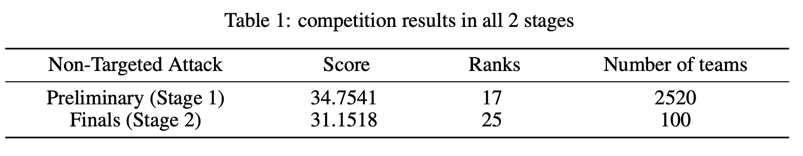

对抗样本攻防排名情况

- **信息检索的前沿研究 [A]**

这是我导师开的课，所以我们实验室默认都是要选的，平时讲的内容有些类似本科的搜索引擎，会加入一些推荐方面的知识，还有业界和其他研究者来给一些talk，算是在回顾信息检索基础知识的同时了解一些领域前沿。考核是以小组为单位搭一个搜索引擎，内容自选。我和邵哥在之前施韶韵这门课的论文搜索引擎基础上做了个二期工程，优化了页面和交互，起了简约酷炫的名字PapersM，还增添了标签管理等功能，为此我们当时在FIT熬了好几次的夜。可惜的是最后想加的功能太多，调试稳定性的时间太少，直到展示前还有隐藏的bug，结果上台的时候出了问题，十分影响展示效果。但还好有简洁美观的界面和功能的独特性，以及PPT展示出的工作量，最后人气投票拿了个第二，没有拼过佳姐做的音乐搜索平台。不过心服口服，佳姐的前端和功能真的已经打磨到近乎完美的地步了。回过头看，这门课印象最深的还是和邵哥在FIT楼边吃零食边熬夜的时光了，虽然学到的东西可能主要是前端应用实践，但为了一个共同的目标奋斗的感觉很棒。

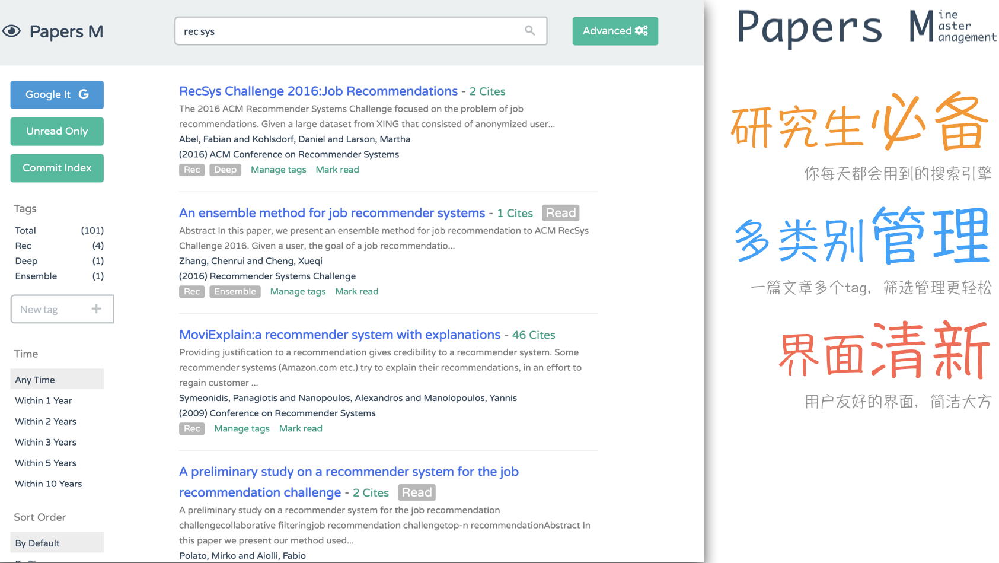

PapersM文献搜索管理平台

- **中国马克思主义与当代 [B+]**

好吧又是思政课，每次签到、每个小作业我都完成了，教学相长的每次问题我也都尽可能写满、写得有深度，最后那堂课的课上小论文我也认真写了，然而又是和自然辩证法同样的得分，我尽力了。值得一提的是这门课的老师在学期中还出过舆论事件，有同学举报他在课堂上政治不正确，一时间在网上传得沸沸扬扬。我们上课的都知道其实只是正常的讨论，谣言根本不属实，老师在舆论爆发后也完全没在课上提这个事，该怎么讲就怎么讲，身正不怕影子斜，让我尤为敬佩。

- **时政热点研讨 [P]**

这门课是博二上的，每名辅导员都要上至少一门辅导员课。这门课其实比我想象中有趣，是以讲座形式开展的，请的嘉宾所讲内容都很贴合热点，有十九大、香港问题、美国青年等等，对这些内容不怎么感兴趣的我也有所收获，有的就应用在了所带同学们的团日总结中。除此之外还有助教带的小班讨论，让我发现我的即兴发言水平确实有所提高，即使没有准备也能说上几句。

- **应用随机过程 [B]**

这是我研究生的最后一门课了，它比起最优化还要难很多。而且最重要的是，这学期是一个北大老师来教的，第一年换老师，之前的资料全都没有用了，所以没有作业参考、没有考试资料，全靠对知识点的掌握情况进行复习，这种体验很久没有过了。课程难度还是挺大的，包括基础概率论知识、泊松分布、马氏链、鞅论、布朗运动、均方分析等，而且老师讲课虽然很和蔼，但给人的直观感觉就是一直在抛出概念和定理，然后证明，能看出来老师水平很高，但讲课的方式真的很难使人全程集中注意力，我这种基础不强的同学也很难一直跟上节奏，还是最怀念本科唐宏岩老师概率论的讲课模式。

这门课让我没有退的理由在于抱了学弟大腿，让我看到了有数学天赋的人是怎么学习的，真的会有很多我半天看不出来的变换他一眼就能看出来，还能延伸很多相关的定理和应用，问起他是如何做到的，直说熟练而已，着实佩服。平时的作业非常难，经常需要一整天才能完成，有些甚至连大腿也需要很久才能想出不一定很优美的做法。所以这门课其实挺费时间的，每周至少花去一天。期末也是十分忐忑，一方面没有参考资料，另一方面当时其他事情繁多，拖着一直没开始复习，真正复习的时间不到一周，又体验了一次把自己锁在图书馆埋头整理知识点的感觉，不知不觉我还挺享受每个期末的这段时光的，可能我**真的很享受什么都不顾，自己全身心投入做一件事的感觉**。可惜这应该是最后一次了，之后就没有课啦。最后期末60分的题做出40多分，有一题本来可以做的有点遗憾，但自认还可以了，这门课也让我认识到数学如果想达到大佬们的程度还需要太多的努力，也许我更应该在其他方面做到极致，而不是在这方面死磕，妄想很快达到身边学了十几年竞赛同学的程度。**做自己擅长的事，其他方面向别人汲取经验，尽自己努力就好了**。

到这里研究生阶段的课程生涯就结束了，剩下的就只有文化素质讲座和毕业论文答辩了，当然以后不排除还会选一些有趣的课。另外发现放到一起看的话我的**研究生课程有高度一致性，硬核数学课都是B，思政课都是B+，专业课都是A-及以上**，最后年级排名大概20%。虽然有一些遗憾，但也算是给我靠成绩吃饭的日子划上了一个还算圆满的句号吧。

---

### 辅导员——三大战役

“三大战役”是我们在辅导员年终述职时想到的总结词。这一年以暑假为界，前半年主要是日常工作，还有”学风讨论月“相关活动，此外没什么大事，也借此机会花了更多时间跟同学聊天；从暑假专项活动动员开始，三大战役就正式打响了，持续两个多月国庆群众游行专项活动是第一战，十一结束后几乎完美衔接一二·九合唱比赛，在一二·九步入正轨的同时又开始了党建这一持久战，各种“不忘初心”主题活动外加两批党员发展的流程让我们是焦头烂额。下面就对这三个事件详细聊一下我的真实感受。

**专项活动**

十年前也有类似的国庆群众游行活动，不过是以刚军训完的9字班同学为主力的，还留下“八天七夜”这样广为流传的故事。而我们这次由于筹备较早，在暑假就要开始训练，所以自然我们带的8字班大一同学就成了主力。这场战役从动员开始就困难重重，还记得我们周一学生组例会接到这个任务，只有一周的时间，由于保密性等原因，我们通过班会、串寝、电话、微信语音等方式把年级里所有人都过了一遍，对于本来不愿意但有可能动员的同学一个一个打电话安利。那个周末很早和梁定了去西安旅行的票，于是就有了**在西安的城墙上发微信**、在星巴克发语音、在酒店打电话的难忘回忆。最终，我们年级成功动员了将近80人，占计算机系本研总参与人数的三分之一还多。

真正开始训练后，我们8字班的同学分散在两个中队，大部分在我作为中队长的703中队。训练的过程可以说是痛并快乐着，从最开始动员会见到中队教练、到中队分练、到东操合练、再到外出验收、最后到长安街演练，有很多难忘的经历。

在**学校训练的阶段还是比较安逸的**，每天早上和傍晚各训练两到三个小时，还记得每天一大早校园里都是穿着同样服装的同学一起前往东操。而那时每天除了训练、回来给同学们发下一次的训练安排，之后就是睡觉，睡起来准备下一次训练，什么都不用想，除了皮肤肉眼可见地越来越黑之外，还是挺享受的。同学们劲头也很足，努力尝试标齐排面，走出当代大学生的风采。也正是因此，第一次方阵验收我们清华的方阵获得了总分第一名的好成绩。

之后就开始遇到频繁的改需求，我们被告知不需要走那么齐了，要足够欢愉，边框走齐就好了；我们被告知要边走边做动作了；我们被告知动作又换了......这给同学们的心态带来了很大影响，就**像刚装修好的房子要拆迁一样**，很不是滋味。中间我们也通过开展党团活动、大队给同学们买慰问物资（400杯奶茶的外卖订单我还是第一次见）安抚同学情绪。到后来我们都看开了，欢愉就完事了，只是觉得只是这样走的话并不必要训练那么长时间。这期间也经常需要外出合练，每次外出对我们都是一个大挑战，经常是凌晨坐车外出，第二天上午合练，基本等于熬一整夜，我有时会从第二天中午回来一觉睡到晚上11点。再加上我作为框架骨干，相比其他同学还会多几次外出合练，那一段时间确实有点精疲力竭。

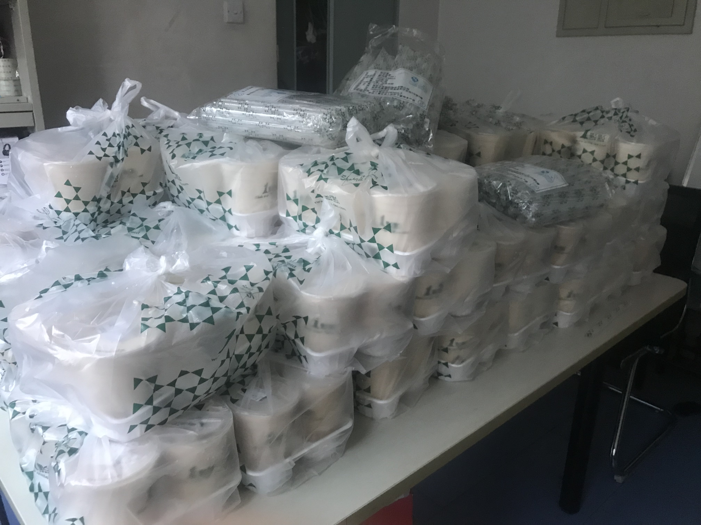

400杯奶茶

再后来暑假结束就进入正常的学期了，日常训练也基本没有了，只剩隔一两周前往长安街进行一次演练。这又给我们带来了全新的体验，所有的演练手机、钥匙等什么都不能带，傍晚出发坐地铁前往长安街，凌晨演练，到清早才能坐地铁回来。所以我们多了诸如坐在地铁站门口打狼人、“坐”地铁里睡觉、在长安街席地而睡、开“茶话会”等难忘经历，很多小学时候的娱乐方式都被搬了出来（加手指、憋挡轰）。

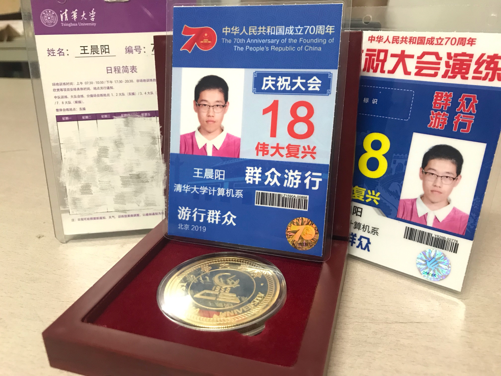

各种训练证

至于最后的十一游行，说实话我倒没有那么深的感受，就像平时的一次演练，只不过变成了上午走。还记得早上到长安街虽然说了不让睡觉，但我还是没忍住靠着路灯睡着了，而且睡得特别香。让我着实感到振奋的是开始阅兵的时候，第一次能够近距离亲眼看到总书记坐车在面前的长安街驶过、看到国家引以为傲的现代化武器（”东风快递“...），听着旁边对军事科技很熟悉的同学的解说，由衷地感到一种骄傲和自豪。

相比最后簇拥着总书记画像走过天安门广场，喊着”祖国万岁、青年加油“、”总书记好“，反而是训练中的一些细节让我印象更为深刻。既有我们中队在云南缉毒参军回来的同学、又有和教练一起去曾经晚上训练去上过厕所的王府半岛酒店吃饭、还有跟同学玩词语首字母接龙唱歌、框架训练回来凌晨5点在桃李二层吃的清汤方便面、李导在车上腾格尔版的日不落、以及最重要的，**跟我们年级的这些同学有了更深入的羁绊**。

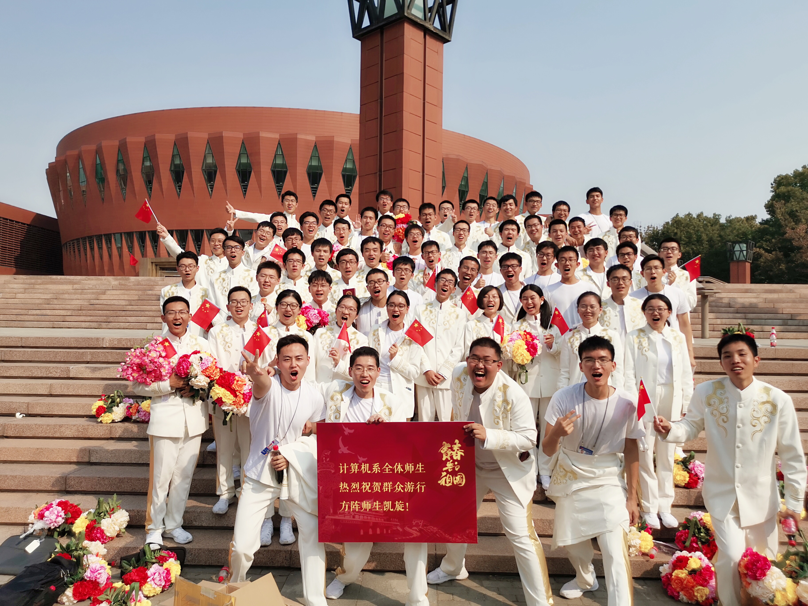

703中队合照

这期间也让我深深感受到了**组织这么大型的活动是多么千头万绪**，每一个方面都要做好足够的保障工作。训练的时候要提供水和应急食物、以及医疗用品；外出验收的时候要确定大巴车的排布、到达时间、停车范围、车上的饮食。我作为中队长相比同学更能感受到学校做了哪些保障，可以说已经尽最大努力做到无微不至了。比如外出合练时，学校给每辆车提供丰富的餐包，为了让同学满意，广泛征求对于餐包内容的意见（虽然现在只记得咸菜和卤蛋了）；还考虑到夜里出行，配置了手电筒和晕车药。让我印象最深刻的是十一当天游行回来的时候，由于那天上午很热，在天安门广场欢愉完又跑到地铁站，一路坐回学校没有水，当时就特别想喝一瓶冰可乐，结果一进校门，真的有校会的同学在西门给归来的同学分发冰可乐，我当时几乎留下幸福的泪水。

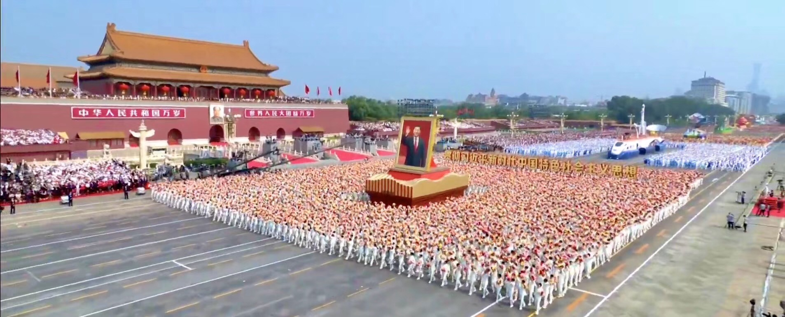

第18群众游行方阵

最后，一系列的表彰和纪念品接踵而至，并且在我们的争取下，计8党支部也成为专项活动中的先进集体，这场战役算是落下帷幕。总的来说，以一名中队长的身份参加这次专项活动，我一点也不后悔，我可能一生也不会再有类似这样的经历了，我始终认为，**多一种经历永远比追求短时间内的成效重要**。但其中也有一些我做的不到位的地方，比如在给同学们小学期争取优待方案和处理最终不同老师调分争议时，就由于太为同学着想，惹得老师不高兴了，我自己也有说话表达上的一些问题。有时还是要明确自己辅导员的职责，不做越界的事情，教务上的事情就让同学和老师自己联系处理，**不做同学和老师之间的双面胶**，两头都不落好。

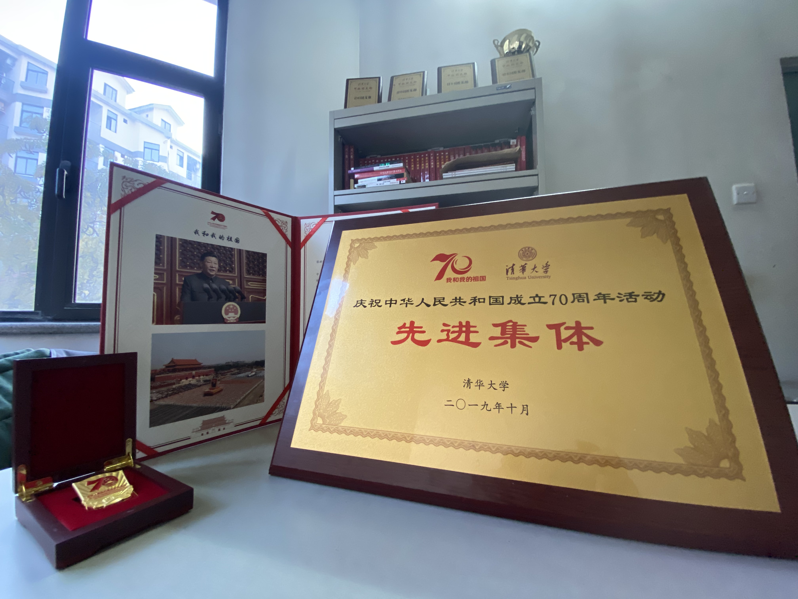

计8党支部先进集体

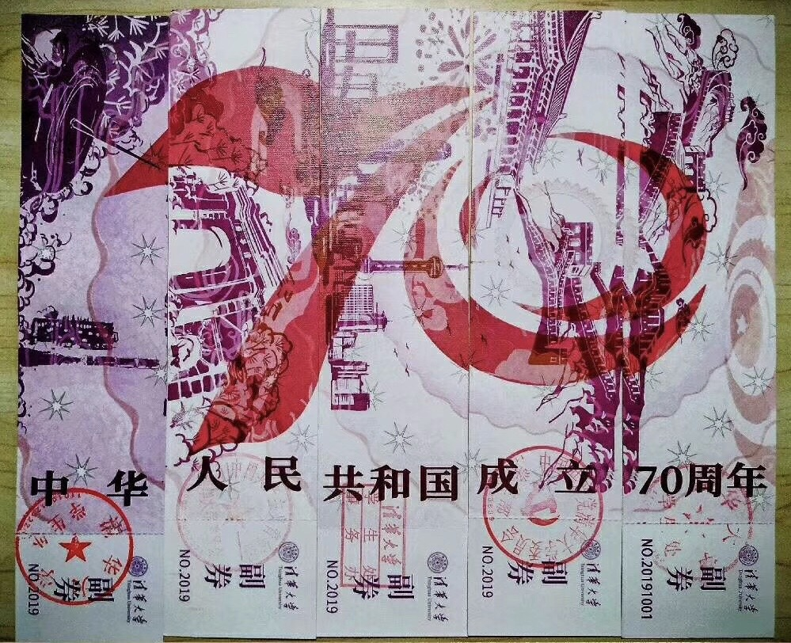

清华外出训练纪念餐券

另外值得一提的是，在我们系的宣传小组头脑风暴时，我提了一个横版漫画可交互推送的点子，每个同学可以翻自己的点位号看到自己的名字，得到了大家的一致好评，我也因此负责这个推送的制作。当时只有一个点子，具体怎么制作其实有很多问题：找谁画？画什么？统计数据怎么收集？秀米是否支持如此多可交互元素？但我觉得这个推送很有意思，所以非常想把它做出来。于是找美院团队帮忙（还借此机会蹭了两张情侣头像）、拉其他负责人帮忙收集数据、每天和美院那边对接具体漫画表现效果、解决可交互元素太多无法导入微信公众平台等等问题。最后经过两个星期每天的打磨，最后形成了一篇独树一帜的推送，而且在10.2就发出来了，远远领先于其他院系的宣传推送，这篇最终不仅获得了近5位数的阅读量，还得到了新闻学院老师的高度赞扬：“**能在这么短时间做出这样高质量的推送，不愧是计算机系**”，殊不知在两个星期前我们就开始策划了。并且据晓涵说在校团委书记例会上也得到了学校的点名表扬。这篇推送可以说是专项收尾阶段给我最大成就感的一件事了，也为专项活动划上了完满的句号。

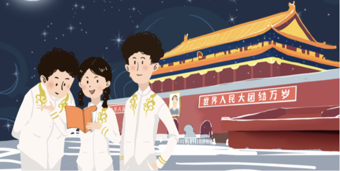

推送中长安街排练漫画

**”一二·九“合唱比赛**

这一次的”一二·九“我阴差阳错地担任了两个院系联队的领队。得益于晓涵的social，我们第一次和美院联队，男女比非常平衡，而且由于近几年我们系本科一二·九一直都是综三，我特别想这一次好好准备，争取打破这个局面。于是十一那天刚结束，几乎是**无缝对接一二·九**，睡了一觉我就开始着手请教练，考虑到之前我们本科的时候教练水平高，人也有趣，我就要到了他的联系方式，顺利联系上了。

之后的过程基本是按部就班的来，但每一项都其实要花费不少的精力：两院系动员会、分声部选人、定每周排练频率和时间、排练中的物资慰问、考核确定最终上场人选、定服装、定舞台效果和舞监、主题活动开展、现场化妆、当天物资保障、活动后纪念......**当时参加的时候远远没想到背后的筹备有这么多事情**，但好在和美院的导合作很顺利，教练也很好沟通，大部分事情都能够顺利完成，不得不说这个过程中我自己的组织协调能力也有所提升，但我也确实感觉到其中有一些我组织不当的地方，很多都太放心交给教练了，没有对可能发生的情况进行充分估计，最初确定参加训练同学的时候也没狠心把不能全部参加排练的都筛掉，导致考核的时候有一些混乱。但不管怎样，我现在也认为整个组织的过程是很开心的。

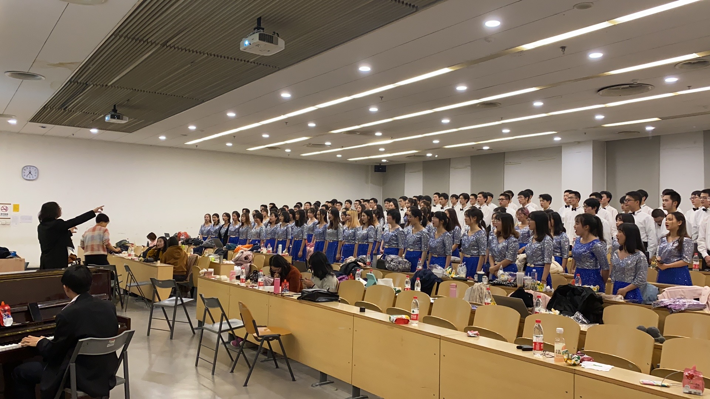

最后一次排练

然而至于最后的结果，一下子把我**打入了谷底**。当天大家上台前气势很高涨，我们在美院化了妆，吃了赛百味，给大家讲了最后的注意事项和上场动员。临走前教练指挥完整唱了一遍，效果非常好，我当时就觉得这次至少也要是综二了吧，而且除了临场的艺术水准分，前期的组织育人和主题教育分我们也基本都拿满了。到实际上台的时候，我在台下看一方面很激动，另一方面又有点担忧，因为我发现上台慢了很多，而且表现效果上跟之前联队比有点不一样，隐约觉得声音听起来不那么优美，但整体效果上还是觉得比很多其他联队优秀很多，所以也没太在意，只是稍微有点担心。

辅导员合影

台上的计算机美院联队

终于到了上台领奖的时候，发现前面的每个单项奖基本都有我们，我当时就觉得不对劲。最后到了颁发综合优秀奖的环节，先公布综三，由于我们联队人数最多，如果有我们的话这个奖项一定会先念到我们。我一直在祈祷不要听到“计”开头，结果马上就是“计算机美院联队”冲入耳膜。我强装笑意上前领奖，但心早已碎了一地，甚至不敢去看我们联队的观众席。

又是个综三。

后来得知确实是艺术水准分比较低，虽然我们现场的演出水平确实比传统强队差一些，至少也不至于是最后梯队吧，我和教练都十分不解，说实话当时心情非常难受，有种付出都白费的感觉。我在从综体回美院的路上还一直强装开心，想让同学们振奋起来，不知道是不是自己的原因，看同学们也不是很有成就感的样子。记得我们的钢伴还一直特别自责，因为他觉得有一段他弹慢了，没跟上合唱的节奏，回到大本营之后他坚持要重新弹一遍伴奏。**那时全场寂静，都在认真听这不知道听了多少遍的伴奏，只是这一遍，没有人声了**。我一直强装的情绪就差点要崩溃了，但还是强忍着。

最后我们所有辅导员和教练去高兴火锅聚了个餐，那时我也没有表现出来，晓涵本来还担心我的情绪，见到我松了一口气，说还好没有大问题，但殊不知我内心真的想一个人静一静，深感辜负了大家的信任。聚餐很愉快，我有那么一点好转，但最后回去的路上我的电动车在六教附近没电了，我不得不慢慢推着车走回去，**这成了压倒我的最后一根稻草**。一个人走在冬夜的冷风中，想到付出了那么多却惨淡的比赛名次、群里同学们大片对教练的鼓励却很少对我们辅导员的安慰，**让我觉得特别的委屈，不由得掉了几滴眼泪**。

那天我睡得很晚，凌晨三点发了一条”**不畏前路，不馁于行**“的朋友圈勉励自己，虽然没有好的结果，但至少对同学们来说这段经历还是有意义的；而且即使委屈，后面的收尾工作还是要做（当时想到这其实更委屈了）。回收同学们的衣服、整理花销、处理报销事务，这些都不能耽搁。最终，**一二·九这一战在一些杂务中惨淡收场了**，难受吗？难受，但还是要继续。

总结教训的话，我认为主要有两个方面：

- 首先最开始教练对我们的预估有点高了，选了难度太大的《天路》；
- 另外教练朴素追求唱功的演出风格并不契合评委追求形式的评价体系。

结果就是这首高难度的歌没有完美地表现出来，同时也没有新颖的形式让评委眼前一亮，低分也就可以理解了。但不管怎样，在组织育人和主题教育这些方面这一年还是做得很不错的，再加上这次选教练的经验，相信下一次我们一定能有所突破。

**党建**

这一部分虽然不是我主要负责的，但博二上这学期的党建任务确实也十分繁重，可以称得上是又一场战役了，而且是持久战。这学期正好碰上“不忘初心”主题教育，有很多规定动作需要开展，比如党支书讲党课、教师联系基层党支部、党支部志愿公益活动、党员问题检视与民主评议等等；除此之外，我们这学期还发展了7名党员，熟悉党员发展流程的应该知道这意味着多少材料和准备工作，而且更可怕的是，新上任的系里负责党建的杨波老师各种ddl都定的非常早，材料准备从通知到上交经常只有几天。虽然这学期每次学校统计数据我们系都是最早且超额超量完成任务的，殊不知背后都是我们这些一线辅导员一个个被逼疯的日夜。

我之前其实对党支部事务不是很上心，但这学期在第二批党员发展的时间点，正好赶上李导很早就在这时候定了论文赶完去阿尔山的旅游计划，所以这些同学的发展材料和发展会就落到我一个人肩上了。我基本从头去学各种材料繁琐的填写要求，但还是被杨老师挑出来不少错，改来改去花费了大量的精力。

其实我不是不愿意做这些事，而是入党相关事务实在是太过繁琐而且要求严苛，所有内容都要手写，而且不允许任何涂改，老师还总有修改建议，甚至不同人的修改意见是矛盾的，有种为了给建议而给建议的感觉，就准备材料准备得很憋屈。还记得有一次赶ddl前开了发展会，却发现邓老师作为党支书签字签错了地方，只能用胶带粘掉或者全部重写，**我和李导在寝室鬼哭狼嚎觉得要活不下去了**。最后我用胶带粘到凌晨1点，李导据说补评语补到第二天早上，我起床接力把材料交到东主楼，算是赶上了这个ddl。

下学期就要拆分党支部了，我要担任其中一个党支部的支书，虽然对这部分工作不感兴趣，但还是要尽量保质保量把基础任务完成，希望自己能坚持下去吧。

**反思**

总的来说，这一年的辅导员工作勉强能给自己打个及格分吧。有做的好的地方：

- 在同学们面前讲话越来越有气势了；
- 需要严谨细节的地方做得很好，像之前的推送，还有奖学金评比；
- 担任总负责人的几个活动在组织协调上没有出现大的偏差。

也有很多不足的地方，深感自己的能力相比辅导员的要求还有挺大差距：

- 下半年由于三大战役的原因基本没有找同学聊天；
- 感觉能给大家提供的建议越来越少了，特别是没有信息差以后；
- 把社工方面的优先级放得比较靠后，需要更大的热情。

希望明年能更多投入一点到自己擅长的工作上，其实这学期想通了一点，我不需要在各个方面都刷自己的存在感，我擅长细致的事务性工作，就在这方面做到最好；而不是一直受制于如何在我不擅长的思想引导上做点什么，那样自己做的不开心也起不到很好的效果，这方面是李导的专业就交给专业的来。

这些都是我跟美院导合作后产生的感想，他们那边的展导就不怎么在大会上跟学生讲话，平时也比较沉默，但在物资保障、财务上特别专业。这种导可能在同学们面前露脸不多，相比其他导不那么受欢迎，但我们需要这种导。我觉得我也适合做这些事情，之前我总是觉得不做抛头露面的工作得不到同学们的爱戴，这样导致我擅长的工作也没能做到很好。现在我想通了，我会尽力把自己的本职工作做好。**不必面面俱到，那样你可以被任何人替代，却不一定能替代任何人**。

---

### 生活——天不遂人愿

生活单列出来是因为这一年在这方面遭遇了比较重大的变故。

**亲人离世**

一直以来，我都很怕接到爸妈突然的电话，因为我怕突然听到爷爷奶奶姥姥姥爷的坏消息。年初的时候，我通过微信了解到从小和我最亲的奶奶在家摔了一跤，磕到了头，正在医院治疗。我虽然担心，但听爸妈的说法好像还是可以治愈的，只是可能要坐轮椅。但到后来病情加重，已经不怎么睁眼了，在家静养最后的日子。五一假期的时候，我买票回家，想见奶奶最后一面，梁也主动跟我一起回去看望奶奶。见到奶奶的那一刻我明白爷爷为啥不主张让我回来，瘦骨嶙峋地躺在寒假我们最后见面的沙发上，浑浊的眼睛失去了往日的光芒，鼻子上插管来维持营养，嘴上盖着薄薄一层浸湿的纱布，防止张嘴导致的口干。爷爷只是希望给我留下一个美好的最后印象。

寒假最后见面的时候，您坐在沙发上，一个踉跄还差点坐空。我把充好电的暖手袋递给您，您笑着说“我不用”，一边递回来一边握住我的手，念叨下次回来就到暑假了吧，我还说研究生了暑假也不知道能不能回来。

现在，我不到暑假就回来了，却不知道您还能不能看到我。想到这，我坐在沙发旁握着奶奶的手，眼里噙满泪珠。

五一过后，我就回学校了，我们都知道，奶奶只是在安静地等待最后时刻的来临。我曾经不相信托梦，直到某一天晚上，我突然梦到了奶奶，内容虽然很模糊，但我早上起来就觉得不对劲，下来看手机发现连着几个妈妈的未接电话，我知道肯定大事不好，果然，奶奶去世了，第二天就要火化。我当时很想哭，却怎么也哭不出来，只是马上买了下午的票，梁知道后也坚持要和我一起买票回来。由于事出突然，我们只买到了转车的方案，第二天早上才到，一下车就直奔奶奶家。

就等我了。

后来的流程感觉就是在机械地走着，紧急买了一件黑色的短袖、赶往火葬场、告别遗体、爸爸声泪俱下的悼词、抱着奶奶的画像看遗体进入冰冷的机器、又抱着骨灰盒回到家里，我一直没哭出来，旁边有谁，说了什么话也都不知道。和各路亲戚在外面吃完饭，回到空荡荡的家，跟爷爷两人坐在安静的卧室里，寒暄了几句家常，两人都没再说话。突然我听到当兵出身、一直很坚强的爷爷在用手帕抹眼泪，我忙低头把床头的纸巾递了过去，直到这时，不知怎么的，我一时间泪如雨下。

奶奶，您总一遍又一遍地唠叨我太瘦了，怎么吃不胖。现在，我吃胖了，您看到了吗？

**情感危机**

除了亲人离世，后半年在感情上也遇到了些问题。具体就不在这里细说了，整个过程更像是和睦了两年后，由于一个导火线把双方对对方的不满都发泄出来了。有一种感觉，我们直到当时都在希望对方成为自己期望中的那个人，而现实的差距我们并没能做到不放在心上，这就使得一点点不满在心中累积，最后借由一个导火线爆发。这里面我确实有很多做的不当的地方，有点太当老夫老妻对待了，没有给予足够的关心。而我同样会为看不透她以及缺少共同话题而困扰，并且经常因为我很难理解的事情生气。有一次吵架后我在知乎上搜一个关于“你是什么时候想分手”的问题，看到其中一个答案让我不禁打了一个寒颤：”当你搜这个问题的时候“。我想分手吗？我觉得是不想的。那为什么会去关注这种问题？也许是因为认识到了现在我们之间存在问题，而且尚未找到确切的解决办法。

我们借此机会也互相倾诉了很多，有一次在下起雪的五道口lush喝酒到凌晨2点，互相剖析了自己和对方存在的问题，也都下定决心会改。所以也准备再尝试一下，之后可能会采取短期同居的方式，看看是否能接受现实中真实的对方。从内心里，我还是希望这次之后我们都能好好的，毕竟，我还是喜欢她的，喜欢她曾经给我的生活带来那么多色彩、那么多快乐。

---

### 旅行——心理慰藉

在这个命途多舛的一年，我仍然没有停下旅行的脚步，它也带给我莫大的心理慰藉。由于下半年的辅导员三大战役、以及和梁的感情问题，今年的旅行主要集中在上半年。从年初寒假的长沙党支部实践开始、学期中去了南京实践、海南开会以及西安旅游、暑假则和早餐群的小伙伴去了乌兰布统大草原。

**长沙 / 延安**

此行是党支部实践，所以很多目的地都是有红色性质的，包括一师旧址、岳麓书院，还去了延安的毛泽东故居。长沙的景色给我印象不深，唯一记得的是在蒙蒙细雨中乘缆车上岳麓山，茫茫大雾和超长的索道让我们觉得在前往仙境，四周甚至连最近的缆车都很难看清。除了景色外，美食是给我留下更深印象的：举国闻名的茶颜悦色、宾馆楼下配几碗饭都能吃完的肉炒肉、大香肠、臭豆腐等等。茶颜悦色我们在长沙的几天不知道喝了多少，也没想到一个奶茶店在长沙竟然有这么大的魅力，一个步行街的路口三个角都有茶颜悦色而且都有人排队，这样的场景我觉得很难见到了。

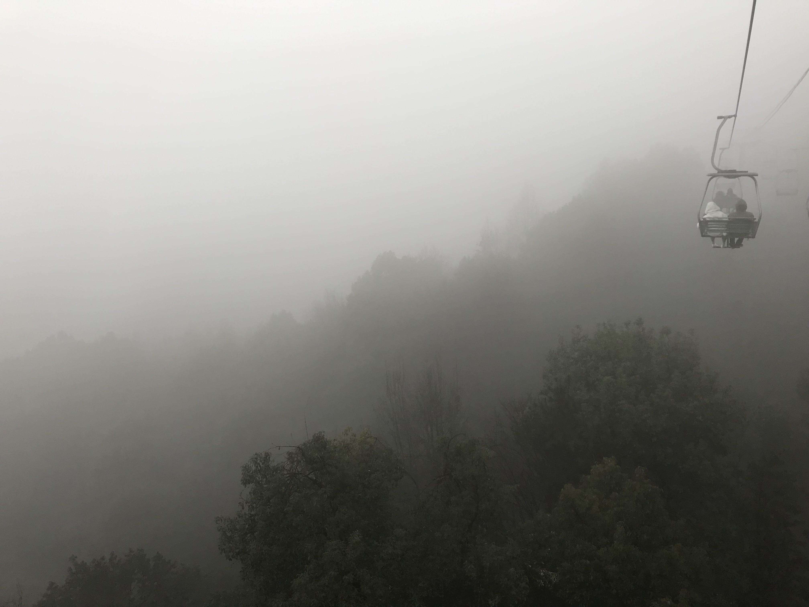

雾中的岳麓山

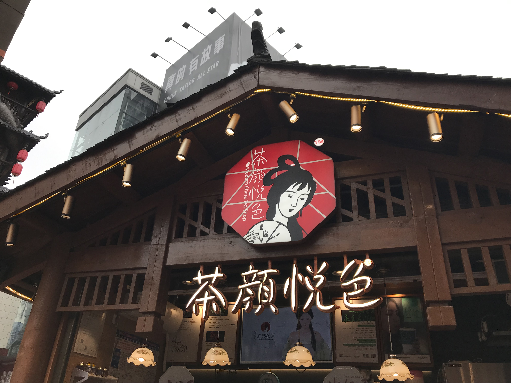

茶颜悦色

**南京**

南京实践是系里的党支部实践，我代表计8党支部去的。说实话红色景点没记住多少，正宗的南京大牌档好评！还有涓豆腐奶茶，还有吃完饭穿过一个公园回到酒店附近吃好几盆小龙虾，开心！

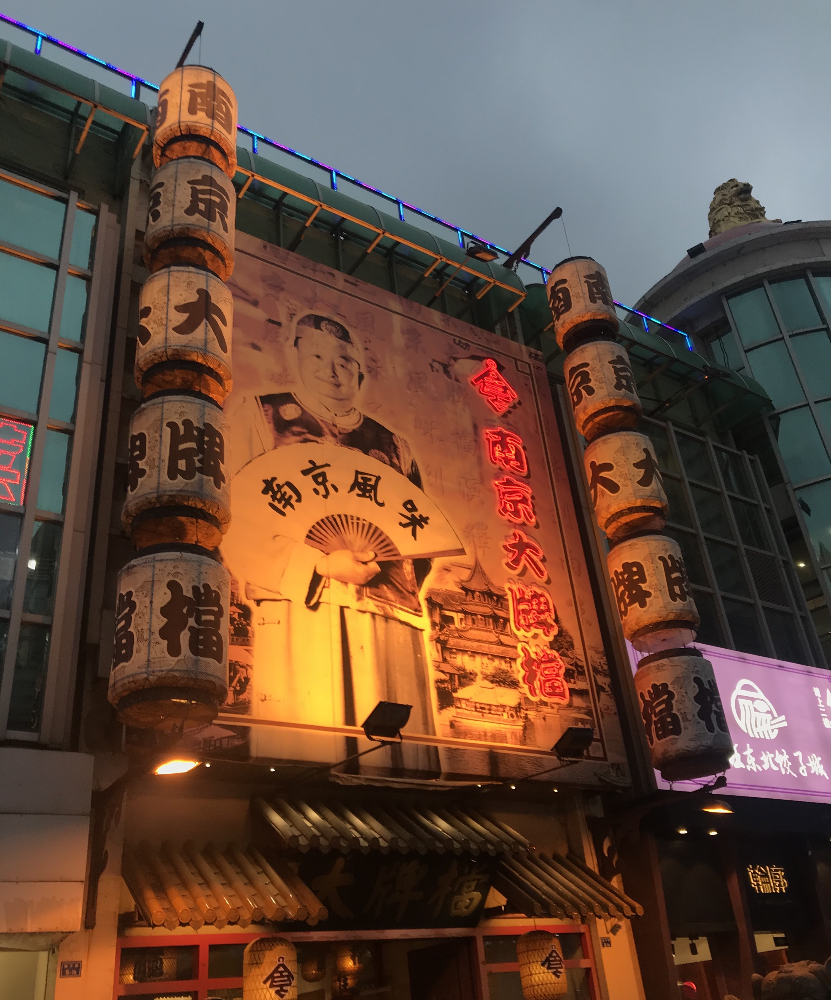

南京大牌档

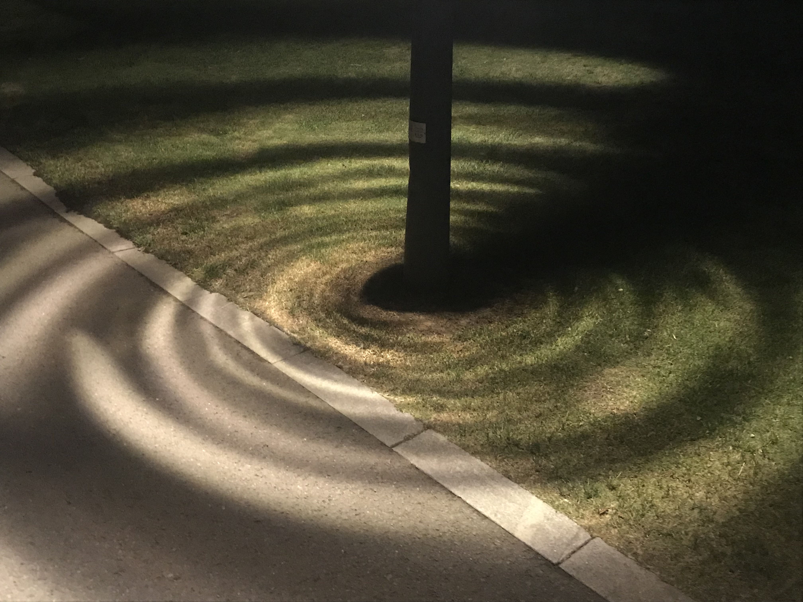

美妙的光影

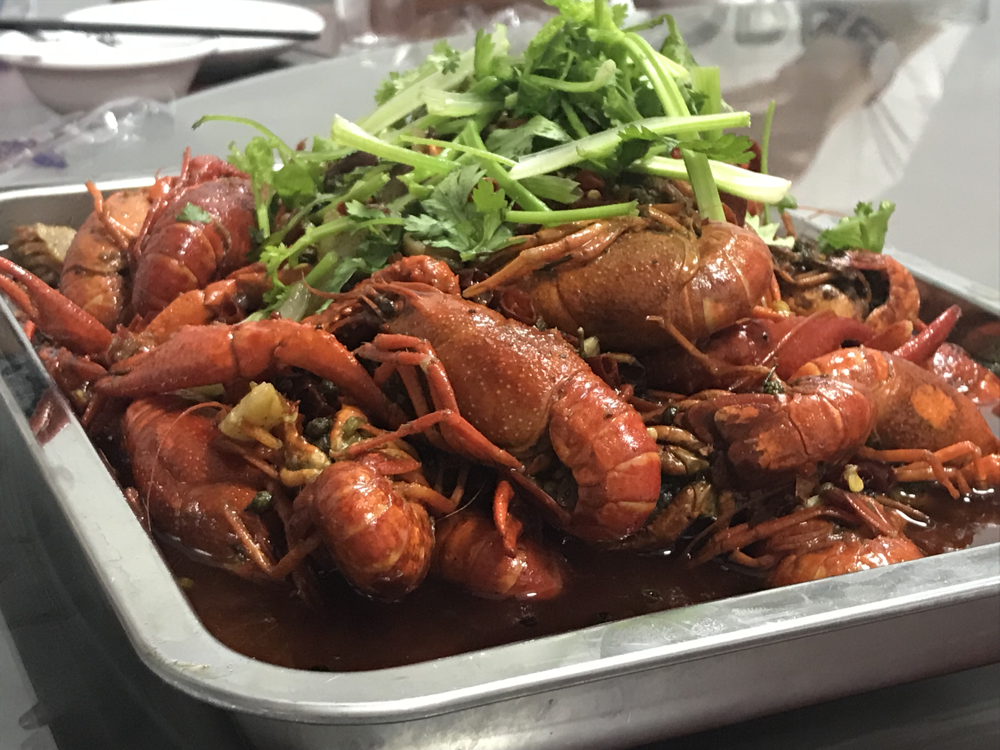

小龙虾

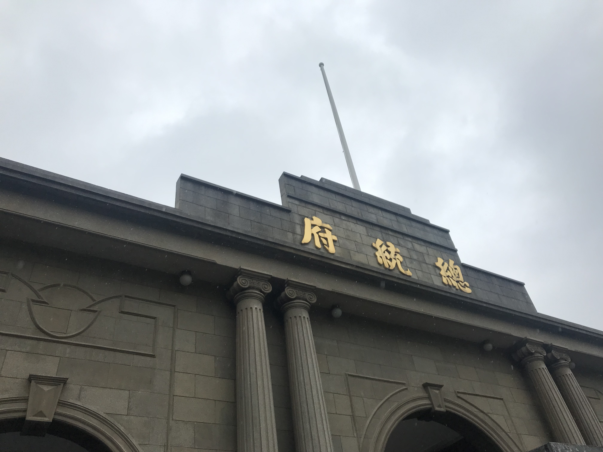

雨中总统府

**西安**

西安是很早和梁计划去的，两天的时间没有去很多景点，而且因为正在专项动员期间很多时候我都在忙着处理微信。但不知为什么，第一天到的晚上她去看话剧，我去星巴克工作，之后去网吧打DNF等她结束一起吃海底捞给我留下了特别深刻的印象，感到非常幸福。还有第二天吃到的不记得什么品牌的甜品、以及在西安坑坑洼洼的古城墙上骑车一圈20公里，还记得最后几公里我们觉得要赶不上火车了，飞速前进累得满头大汗，也别有一番风味。

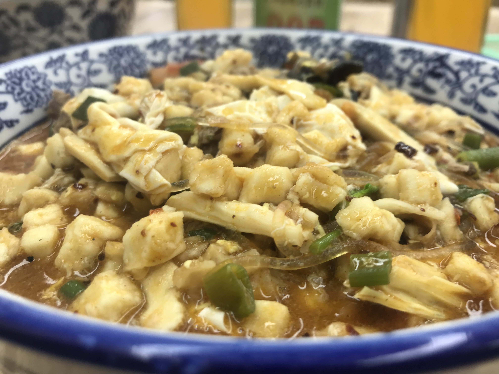

羊肉泡馍

**海口**

这是和实验室的同学一起去的一个自然语言处理夏令营，主要是去学习的没什么时间。所以只去离我们最近的海边和城区逛了逛，说实话海口还挺破的，没有留下什么好的印象。当地特色清补凉还行，还有一个忘了名字的很好吃的粉面。

**乌兰布统**

暑假期间还在专项开始训练之前跟早餐群的小伙伴去了一躺乌兰布统草原，在这里留下了很多美好回忆，有路过承德时凉爽的天气、在湿地公园试飞无人机的新奇、乘越野车穿越草原无人区的颠簸、在车里一首一首唱歌、在无人区吃火锅涮羊肉、在如画般辽阔的草原上踢球、跳大绳、还有美到爆炸的打铁花。此外，同行的三人都是摄影爱好者，我好像跟着三位摄影者出游，收获了不少照片，也因此回到北京时请大家吃了一顿木屋烧烤以表感谢。总的来说是一次非常愉快的旅行。

无人机合影

走在白桦林中

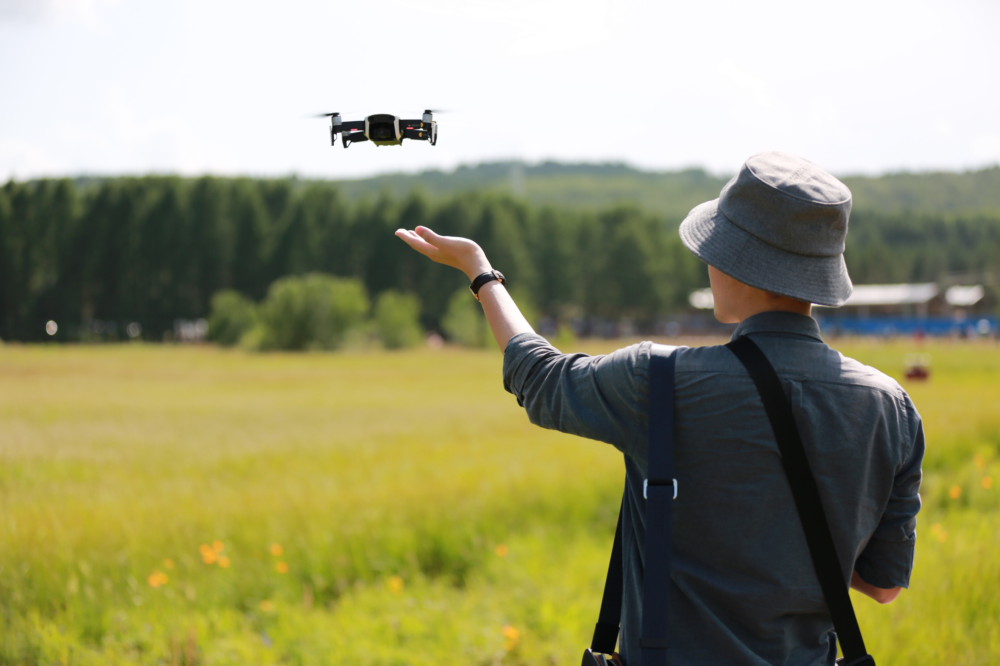

放飞无人机

---

### 杂

还是在这里记录一下其他杂七杂八的事情。

**奖学金**

博二开始的时候正是每年**秋季奖学金**评选的时候，我仗着自己有一篇A类论文、社工上基本拉满，还抱有一丝能够评上博士国奖的幻想。其实对于我们低年级的博士生来说是可以按硕士身份评国奖的，这样竞争对手会弱一些，但硕士国奖在荣誉和金额上会低一些。现在想想当时有点过高估计自己了，竟然想竞争博士的国奖，还因此把只能使用一次的专项加分给用了。虽然这样入围了博士国奖答辩，但最后比起那些一年打底三篇A的大佬来说我还是太自不量力了，最后自然也没评上。不过由于我总分不低，除了国奖大佬再往下数几个就能到我，所以也拿到了比较高的系综合奖。说实话我的答辩自认为还是比较出彩的，事后有认识的台下评委老师还发微信说我答辩得很出色，并且后来告诉我如果是评硕士的国奖（更看重全面发展）很有可能就评上了。这让我十分懊悔，没抓住应有的机会，过高估计自己，也没提前收集更全面的信息，错过了第一年拿国奖的机会。欸，就当给自己个教训吧，本科时候一年级是太低估自己，根本没想着拿奖学金；现在则是一切都太追求最好，没有认清自己的位置，之后要更折中一点才行呢。

**实验室年会**

下半年还有一个我负责的重大事情就是**实验室年会**，我们的传统是每年博二的同学来负责筹备，这一年就是我们，而我也自然而然地担起了总策划的责任。但说实话其实投入的精力并不多，同级的其他同学都很给力，任务分工都能超额完成，所以整个筹备过程还是比较顺利的。其中PPT是我负责做的，也是最开心的一个工作，收集实验室各位同学的荣誉和黑照，最后呈现在PPT上，虽然做起来很繁琐，花了我一整天还多的时间，但边做边笑真的很开心。最终效果也格外好，台下笑成一片。年会当天虽然也出了一些小bug，但总体还算给大家呈现了一个比较完美的年会。同时其中也有一些遗憾，就不知怎么的最后有一些难受。一方面自己很多细节没考虑到，都是其他同学提醒才想到的，也没能很快给出解决方案；另一方面本来可以当主持人的，但由于其他事情比较多就想甩锅，其实自己是完全可以胜任的；此外现场气氛和饭后的娱乐活动大家参与度不太够，总感觉和实验室的同学还没有像之前师兄师姐那样熟络，像有一层似有若无的隔膜，感觉之后还是要更多和实验室的大家交心呀。

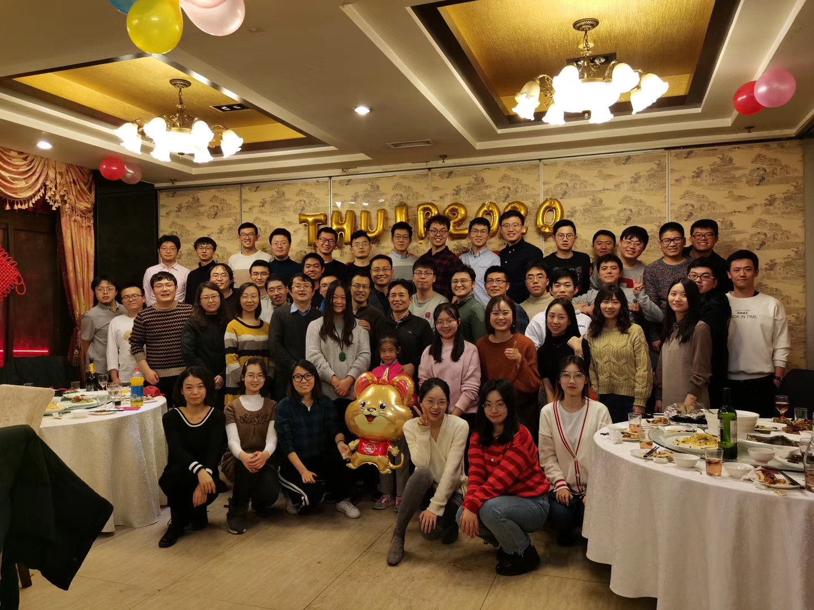

年会合影

**助教**

博一下学期还被导师拉去做本科**机器学习概论课的助教**，挺有趣的一段经历，没想到这么快就从学生变成助教了。这门课的助教任务也很多样，既要准备project给大家讲解，又要在project结束后给大家总结，还要分享写实验报告的经验，这些我都很擅长，也很乐于分享。虽然改作业和期末卷子比较累，虽然最后答疑的时候我自己也有好多不会的，但整个学期下来能跟张老师配合让同学们都满意还是很开心很有成就感的。

博二上学期则跟韵哥一起做了**Java全校任选课的助教**，相比上学期，这个课的助教体验可以说很差了。一方面老师给人感觉一直在发号施令，要求总是张口就来，我们助教就像工具一样，第一节课让我们去上课甚至不给我们机会自我介绍；而且很死板，总显得自己很厉害，一切都是你们的错，就让人很窝火；另一方面课程压力也很大，作为一个任选课，又是实验课作业、又是讨论课展示、又有大作业又有考试，也难怪开学六七十人的课最后退得只剩20了。痛苦的是基本每个人物都要助教去设计，而我们本来对Java不怎么了解，本来以为答答疑什么的还行，结果这些都要自己去搞。特别是期末考试题还要我们全都自己出，还有知识点覆盖等等一系列要求。我们前前后后改了9版，才最终满意。总的来说这门课当助教的体验就是任务极多、老师讲话让人窝火、缺乏成就感、极为不爽。这里也非常感谢韵哥，在这种条件下把很多事情还做得井井有条，而我经常由于情绪原因不想好好做，导致有很多工作都是韵哥承担得更多，非常佩服也有点不好意思。

**设备更新**

这一年比较有成就感的一件事是把寝室和实验室的**桌面打造**得很棒，而且全然是两种风格，寝室极致娱乐、实验室科技极简，娱乐和办公环境得到很大改善。另外换了iphone 11 pro，服役3年的iphone 7实在撑不下去了，听筒容量等方面都是问题。

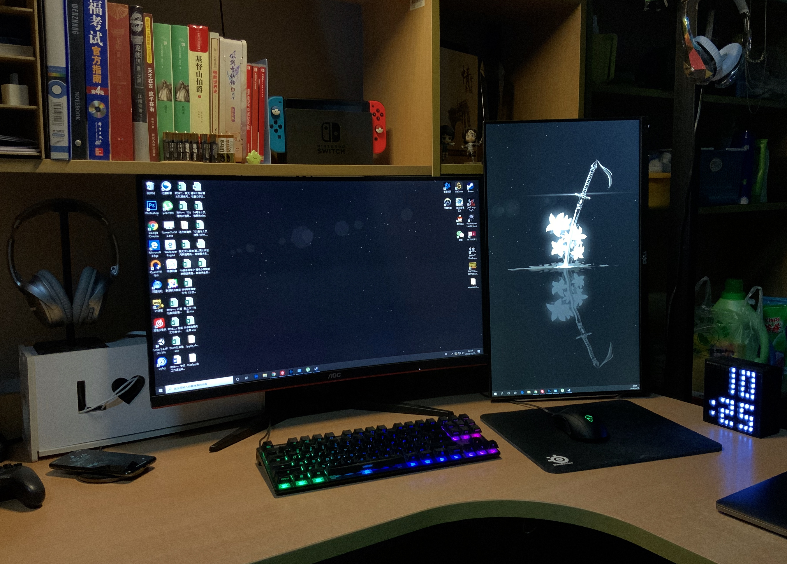

寝室桌面

实验室桌面

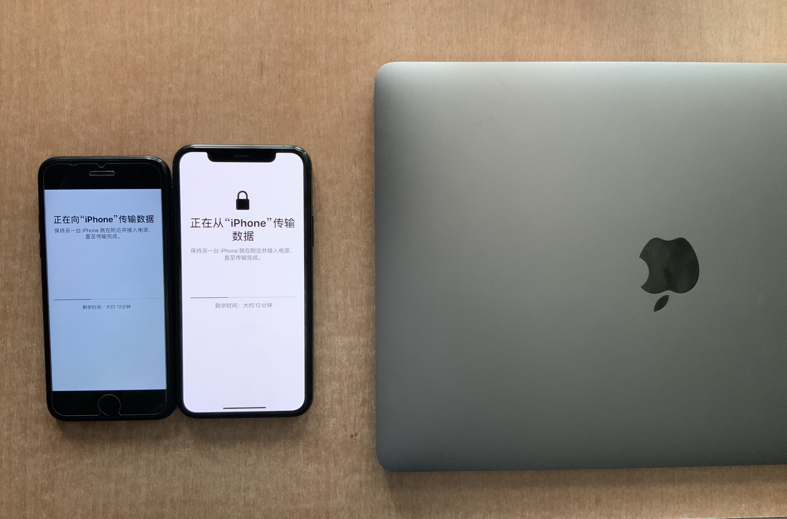

换机纪念

**娱乐**

这一年在**游戏**方面也有重大突破，年初入了switch，一年中购入了不少游戏，让我最为啧啧称赞的要数”塞尔达“和”空洞骑士“了，两者都有极大的游戏容量，丰富的探索要素，真的能给人带来仿佛小时候冒险一样的乐趣。相比起来空洞有更多动作游戏的要素，这一点十分对我的胃口，我喜欢不断磨练自己达到一个目标的快感。而且switch在这一年也充当了多次团建利器，不管是实验室轰趴还是核心班委团建，我都借助switch上的Just Dance、马里奥派对等聚会游戏把气氛调动得很嗨。此外，像风花雪月、异界锁链等游戏也比较出色，但都有一些我不喜欢的点。另一方面，经过专项的洗礼我也成功把DNF戒掉了，终于不用在DNF”上班“了。同时我把更多时间投入了单机游戏，”鬼泣五“和”只狼“是这一年花费时间最多的游戏了，两者风格各异，都带给了我机制的视听盛宴。而且其中的动作元素，特别是只狼犹如高手过招般成败就在一呼一吸间的紧张感，让我尤为感慨。目前卡在三周目最后了，等之后一定要把这个2019年度游戏白金。

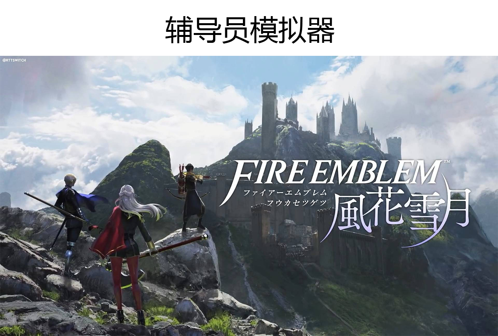

风花雪月玩后感

游戏方面不好的一点是，由于这一年经常遭遇挫折，我变得更多通过游戏来逃避现实，表现出来就是玩游戏更多了，甚至连很久没碰过的炉石和守望都拿出来玩。**越失败，越想在游戏中逃避，越逃避，越缺乏时间去改变现状**。这一点需要引起重视，我觉得到后面我失败越来越多很大程度有陷入这个恶性循环的原因。之后我要努力控制自己，把更多的成就感留在花时间让自己改变上，而不是游戏中击败boss。

**疫情**

寒假期间还遇到了**新型冠状病毒的疫情**，全国上下响应号召不出门，出门必带口罩，万城空巷，体验了一把家里蹲的时光，到现在已经一个月了，开学也未知期限延迟，各种会议和课程都即将通过线上的方式进行。中间既能感受到各种国家响应的高效，也看到很多政府和人性的黑暗面。但不管怎样，这段时间还是很宝贵的，能和父母在一起这么长时间，每天晚上一起看电影、聊天，也是挺难忘的时光了。希望生活能早日回复正常，抗疫有我，为湖北加油。

---

### 总结

都说本命年是水逆的一年，而我在即将进入本命年的2019年就遇到了这么多波折，按时间顺序来总结一下的话：

- 亲人离世，天不遂人愿；
- 奖学金评比高估自己，错失国奖机会；
- 辅导员越发感到自己能力不足，”一二·九“努力仍未得收获；
- 感情方面陷入危机；
- 年会带来的人际关系焦虑感；
- 学生节辅导员节目报名唱歌却上台忘词；
- 沉迷游戏陷入恶性循环和自我否定；
- 科研论文投稿屡屡碰壁。

其实大部分挫折都发生在博二上学期，所以也可以算是这学期的一个特殊状况吧。总结原因的话，我认为主要有这几点：

- 自己handle的方面太多了，这学期科研、社工、课程、助教每方面都需要付出不小的精力，超出了自己的能力范围，导致各方面看起来都做了点，却都做不好，缺乏成就感，于是就陷入自我否定；
- 每个小工作完成后总想休息一下，由于工作更碎更多了，这样总共投入正事的时间反而变少了；
- 自我输入不足，整个学期除了课程外，竟然感觉没有学到什么新的东西，都在用已有的知识解决问题，而从效果上来看现有的知识已经不足，需要更多的自我充电；
- 较大的朋辈压力，这学期其实是收获的一学期，周围很多同学的论文、评奖都在这时候出结果，看着他们取得耀眼的成就，难免会产生自己各方面都不行的情绪，进一步加剧了自我否定。

所以归结来看，当务之急是让自己专注在较少的方面，努力做出相应的成就给自己一点正反馈，重新树立自信。另外多给自己充电，保持学习的状态，比如最近开始给自己制定计划，通过TED来拓宽自己其他领域的知识以及练习英语、通过”开眼“等app增长自己的见识和脑洞、通过论文阅读计划保证跟上研究潮流......

”**一切无法打倒我的，都使我更强大**“，我相信能坚持下去，化苦难为动力。不管本命年如何风吹雨打，我都将砥砺前行。2020，起飞！

