今天天气格外地热，变为年度总结后还是第一次穿着短袖码文。北京的冬天总能在零下二十度和零上二十度之间反复横跳，**就像这个本命年于我一样，可谓是喜忧参半**，喜的是一扫去年这个时候写总结时懊丧的心情，科研和生活状态都有了一定程度的改善；忧的是发生了一些影响重大的变故，其中以感情上的分手为甚。但总的来说，回忆 2019 年经历的种种挫折，如今的自己已不像去年年初那样陷入深深的自我否定，感觉进入了一种新的生活节奏，不得不说之前的总结和反思还是起到了很大作用的，十分庆幸当时的自己能静下心来回顾自己的问题，而不是停滞不前。

对于刚过去的 2020 来说，考虑到其上半年和下半年基本上是完全割裂的，这次就一改之前的模式，按时间顺序而不是从不同方面回忆一下 2020 都经历了什么。

---

### 疫情宅家（2020.2—2020.8）

要说之后回忆起 2020 印象最深的是什么，那想必是整整半年在家的时光了。最初延迟开学的时候完全没想到会延这么久，甚至不知不觉度过了一整个学期。但其实对我个人而言，我**还挺享受这种独自生活、在家科研的时光的**。

#### 生活

爸妈复工之后，我就自己住在新城区的新房子里，一个人独占一栋大 House 的感受真的很难只用一个「爽」字形容，那种惬意让我重新**找到了能够 control 生活的掌控感**。每天可以按照自己的喜好安排时间，不用担心正在健身或娱乐的时候被其他事情打断；不想处理的消息都可以假装没看到，别人也没法顺着网线来打我；打开低音炮音响，在沐浴着阳光的飘窗上工作，在「部级办公环境」的书房任性以各种坐姿干活，学累了站起来转过身就是钢琴；需要呼吸新鲜空气的时候就下去遛遛狗，在花园走一走，从银装素裹走到阵阵蝉鸣...... 

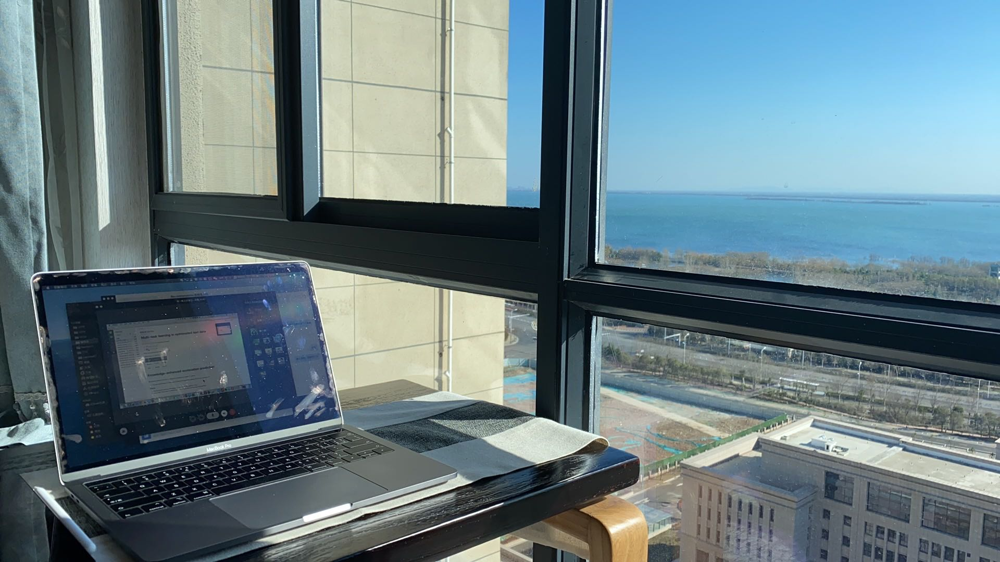

在沐浴阳光的飘窗上工作

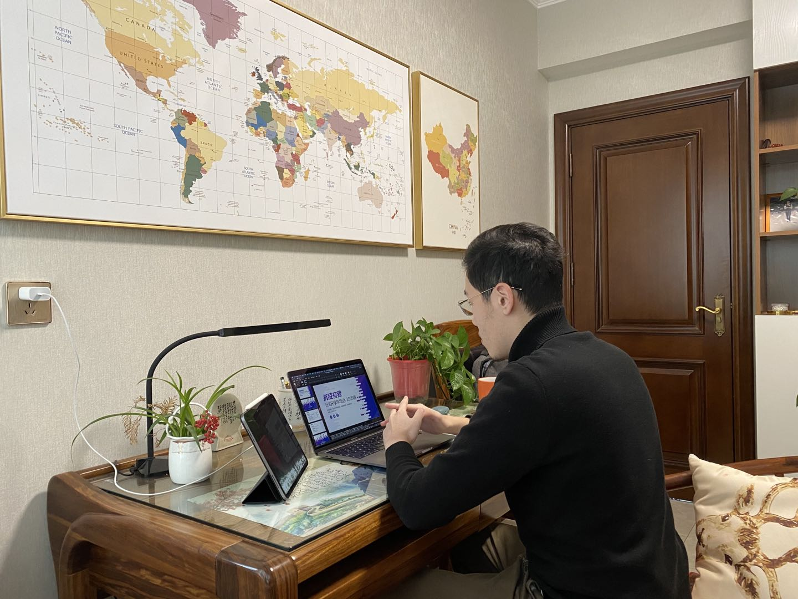

在「部级办公环境」开年级会

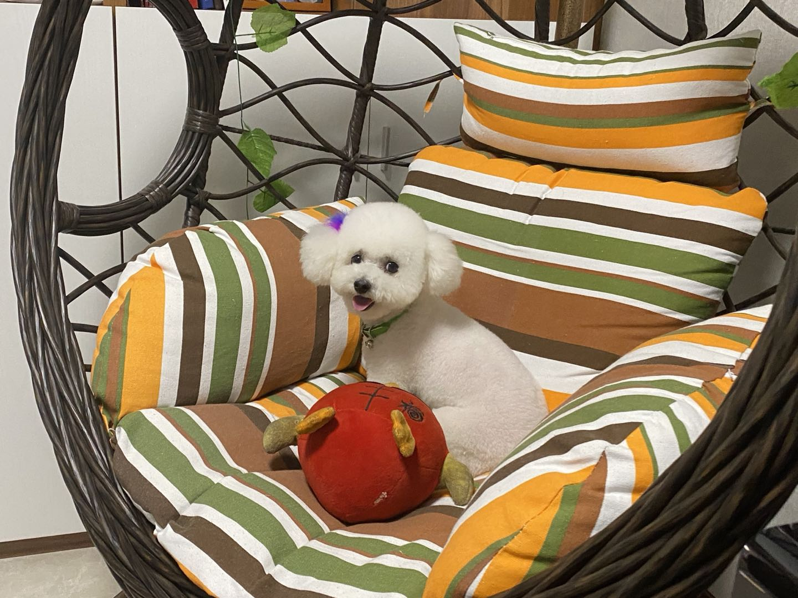

人生一大乐事——撸狗

太多太多惬意的时光了，也是在此期间我养成了非常规律的生活习惯，每天按时健身、按时洗澡、按时散步、按时工作、按时娱乐，几乎**没有什么事情可以打乱我一天的整体安排**，其实很感谢这段时间的规律健身让我的体态有了较大的改善（虽然最后发现并没有起到减肥的作用，反而更胖了...）。除此之外还学习了下厨房的技巧，从之前一个完全的小白（连面条都不知道是怎么变熟的）到慢慢自己能做一些简单的菜（可乐鸡翅、抱蛋煎饺、炒米饭、葱油拌面、煲仔饭......），还是很有成就感的。事实证明艺多不压身，留校过年期间也算是用有限的食材露了一手。

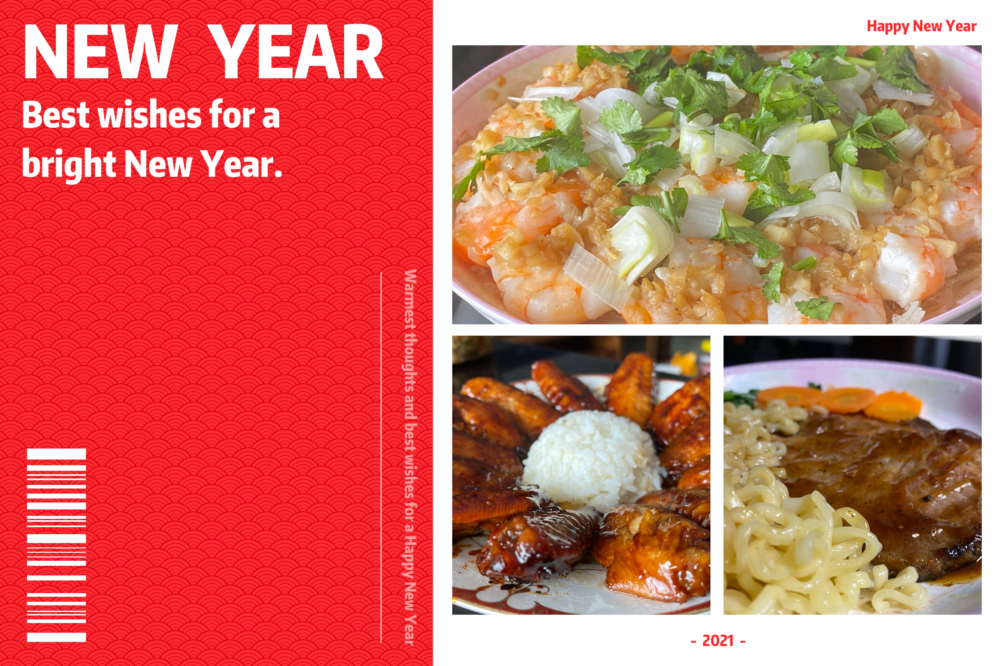

做饭× 做作的摆拍√

#### 科研

另一方面，在家科研的进展也还算顺利。从去年的总结之后，我就把重心放在了科研上，希望以此为突破口，拿到一些正反馈给自己一个激励，让自己尽快回到正常的情绪状态中。为此我**对之前被拒的两篇论文做了深入的分析**，挖掘其中可以改进的点，进行了大刀阔斧的改动，并在疫情期间先后投了出去。

事实证明当时的改动都是非常科学的，其中有一篇出结果比较早，还记得这个消息是老师提前告诉我的，说 SPC 已经决定给这篇 accept 了！当时兴奋的心情真的不亚于第一次中论文，毫不夸张的说，**这个消息是我心态和情绪开始转好的一个关键点**，我真的无法想象如果付出了这么多努力最后又是被拒我还能否坚持下去、还能否有信心开展一个新的课题。而它就在最需要的时候出现了，像一针兴奋剂一样，为我后续的科研注入了无穷的动力。在这之后，我不仅在这篇的基础上萌生了一个新的想法并做出效果投到了期刊，对另外改投的那篇也有信心去补充各种实验和分析。

另外，考虑到之前总结问题时觉得自己的输入太少，疫情期间我有意地去**关注不同领域的前沿成果**，对于 SIGIR 开会时的 keynote 也专门留意听了听。事实证明这些改变也确实是行之有效的，后续一个关于对比学习的 idea 就衍生自开会时听 Hinton 讲的这个 keynote。真心地感受到有时候自己的思路会被已经很熟悉的知识束缚，多听一听其他领域相关的工作能让我从不同视角审视自己领域的问题，带来不一样的解决方案。

在这个阶段还解锁了一些奇怪的经历。比如因为整理了自己那个推荐框架 ReChorus，老师很希望把它推广出去，发了推送还发了推特，最后 Paperweekly 都找上来要办一场技术直播。其实我个人觉得这个框架远没有老师吹的那么厉害，只是我整合我自己工作和 baseline 的一个小项目。但考虑到其轻量的特性，倒也确实挺适合新手去熟悉推荐的常用算法和实验设定的，所以就**解锁了人生第一次直播**。前期宣传看起来很厉害，但越宣传我越心虚，最后实际的直播效果我也挺不满意的，虽然也正常讲完了一个多小时，但当天嗓子不舒服一直在清嗓子，听感可能不是很好，并且由于领域略显垂直，来听的人其实比正常 Paperweekly 的直播少了不少，还是有点失落的。但不管怎么样，能受邀有这个机会还是挺难得的，也算是积累一些经验，后续倒也没有特别受这个事情影响，很快就调整过来了。

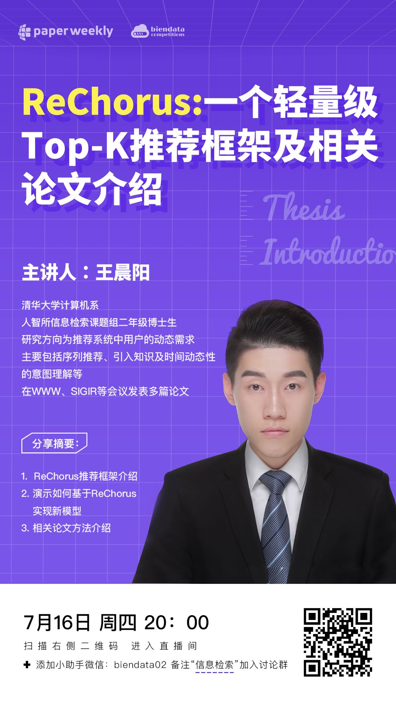

直播海报

总的来说，这半年在家的科研经历可以说是很顺利了，以一篇论文的接收为始，完成了一个新工作以及另一篇工作的改投，最后在离家前成功投出两篇论文（后来陆续都中了），并带着一个新的 idea 进入了新学期，老实说顺利得有点令人难以置信。只希望自己能够不馁于行，继续坚持一步一步做下去，并从追求数量变为追求质量。其实目前来说我对于已经做的工作并不是很满意，我清楚地知道它们并不会对领域发展带来显著的影响。未来希望能多跳出既有框架想一想，**打造一个自己有代表性的工作**，至少要达到让自己满意的程度。

---

### 返校生活（2020.9—2020.12）

回校的火车上我就在想，这一学期**也许是我最无忧无虑的一段时间了**。再往前一年，我还有着论文太少毕不了业的忧虑；再往后一年，我就要面临找工作的种种压力。这个时间点恰恰是什么都不需要担心的时候，所以从一开始我的心情就十分舒畅，即使返校那天（8.17）天空灰蒙蒙的。还记得那天校园内依然只有零零星星的几个同学，见到的大多数是为偌大却空旷的校园保持整洁的环卫工人，respect！于我而言，我觉得最有返校仪式感和纪念意义的是路过清华学堂的时候自动连上 Tsinghua-Secure 时：**在「新位置」找到此网络**。印象最深的则是一路小跑去看我的电动车是否还健在，毕竟连电池都没取在室外放了半年，好在小牛用实际行动证明了它贵还是有贵的道理的 hhh

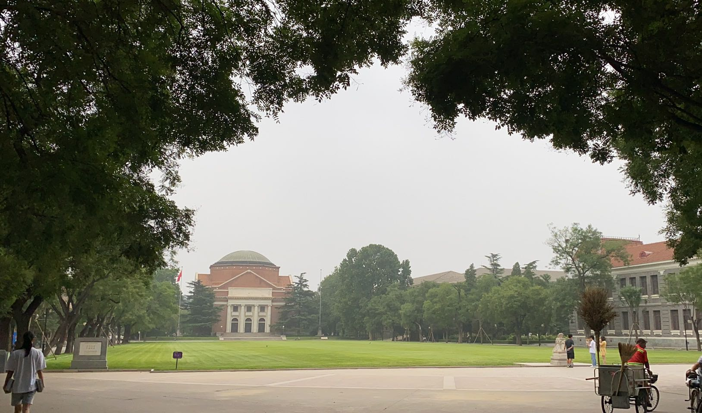

返校时灰蒙蒙天空下的大礼堂与环卫工人

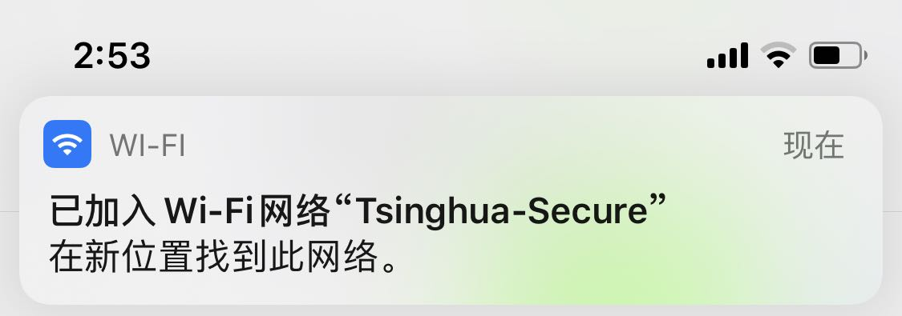

重新在「新位置」连上校园网

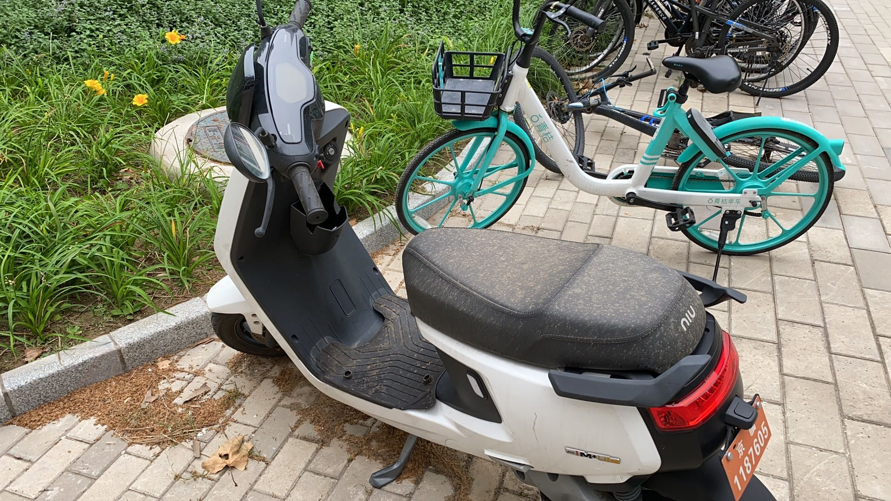

饱经风霜的电动车

经历了漫长但愉快的收拾寝室、恢复工位环境等步骤后，**生活以一种难以想象的速度回到正轨**。除了刚开始出校受到比较大限制之外，其他方面已俨然和疫情前并无两样。还是熟悉的生活，各种事情层出不穷但回想起来又没有什么留下特别深刻的印象。辅导员方面，组织开学班会、党员发展、日常聊天、奖学金评定、主题团日、生涯规划调查...... 日常事务细水长流，往往不知不觉间就投入了很多的精力。这学期还解锁了一些突发事件的处理，比如半夜被敲开门找失踪的同学、陪同学去北医三院等。实验室方面，除了日常的组会，这学期带了两个 SRT，其实有点力不从心。还当了老师在学堂在线一门在线课的助教，说实话这个助教事情又多钱又少，相比学校助教性价比很低，但体验倒也不算差，同学们意外地都很认真。此外还花了很多时间去整理已有工作的代码，再加上之前投出的两篇工作都中了，有不少需要整理的 paper work。**本来想着没有了要上的课也许会更轻松，结果反而感觉更忙了**，因此新的 idea 其实一直没有时间做起来，一直到快年末才着手尝试。

虽然有这些大大小小要做的工作，但正如之前所预想的那样，这学期的空余时间还是有不少可圈可点的地方的（**保持了很长时间「朝九晚五」的生活**）。首先回学校收拾寝室的时候把之前的杂物位收拾成了一个工作位，这样就有一个专门用来在寝室工作的位置和一个专门娱乐的位置，从目前的体验来看还是很科学的，以及在这个过程中发现自己是真的热爱整理，看着整理出来干净的寝室有种莫名的快感。学期中赏红叶的时候和几个小伙伴去了坡峰岭自驾游，景色一般，但自驾的体验真的不错。

变废为宝的寝室工作位

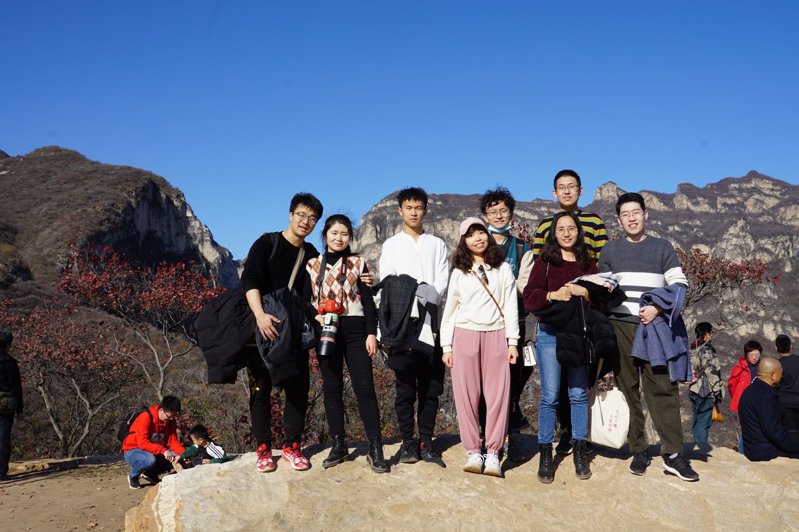

坡峰岭合照

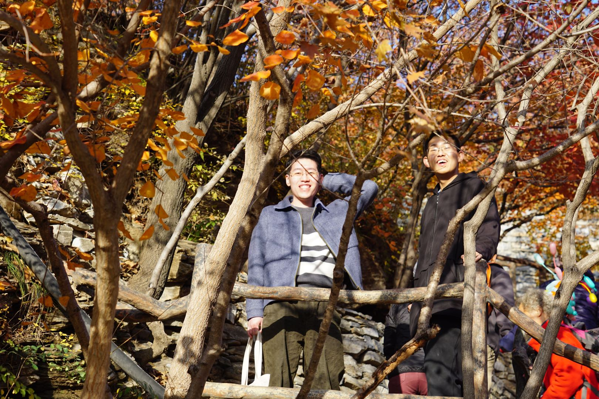

坡峰岭「挠头」

此外，在寝室的生活也越发丰富。自从开发了中厅电视的正确打开方式后，**「108 娱乐室」**算是正式落成，看电影、开 party、玩 switch 成了常见的娱乐活动。学生节前、跨年的时候，108 中厅都成为我们欢声笑语的中心。为了全面响应每周一团建的口号，慢慢还形成了中厅学习会的传统，周末的晚上大家一起点上外卖、倒上一杯酒看剧看电影，学习了不少威士忌的喝法，以及看剧果然还是大家围在一起边吐槽边看最有意思。

总的来说，如果刨除某些因素的话（比如感情），这学期整个的心态和情绪还是非常平和愉快的。与去年这个时候经常觉得自己做不好、拒绝沟通、拒绝交流不同，这学期明显感觉与同学和朋友的交流更多了，也更有自信了，从而**能够更多 open 自己的想法而不是自己憋着**。以前一直觉得我是一个适合自己待着自己消化各种情绪的人，不喜欢掺和他人的事情，也不喜欢主动加入他人的交流。但现在我慢慢发现了与人交流的那种魔力，虽然它需要花费时间去经营，虽然它有时并不解决任何实际问题，但聊天本身往往就是一种治愈。

---

### 留校过年（2021.1-2021.2）

另外一个值得一提的当属留校过年这一个月了，出于多种原因考虑，最后还是选择了留在学校过年，刚开始主要是疫情政策和赶论文的原因，后来则更多是挺想体验一把在学校过年的氛围的，也厌倦了反复纠结的那种心神不宁。本来爸妈想让我回去主要是担心自己在这边感觉寂寞，但其实正好相反，过年这一段时间出乎意料地热闹，该有的年味一个不少。邓公亲手题写的春联一贴，过年的气氛马上就有了；系里和学校也发放了很多慰问，感受到了十足的温暖；最温暖的还是大年三十几个留校的盆友一起折腾一桌年夜饭（感谢邵导成功的寿喜锅 hhh）、围着电视看看春晚。大年初一到初七这几天，虽然还有一些实验室写本子的工作，但能浪的时候也都没闲着，去了导师家拜年，又一次吃到马老师做的饭，还收到了刘老师的幸运红包；在博后家充分体验了自己动手丰衣足食的快乐，大大锻炼了厨艺，强化了 few shot learning 的能力；想看的电影想吃的餐厅也都成功拔草，非常完美。现在站在开学前的最后一天回望，真的感觉非常丰富多彩，比起在家过年有过之无不及，不过最大的遗憾还是没有见到爸妈，开学后有空的时候一定回去一趟。

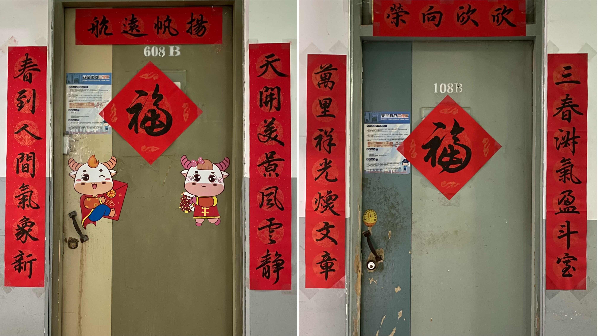

邓公出品的春联

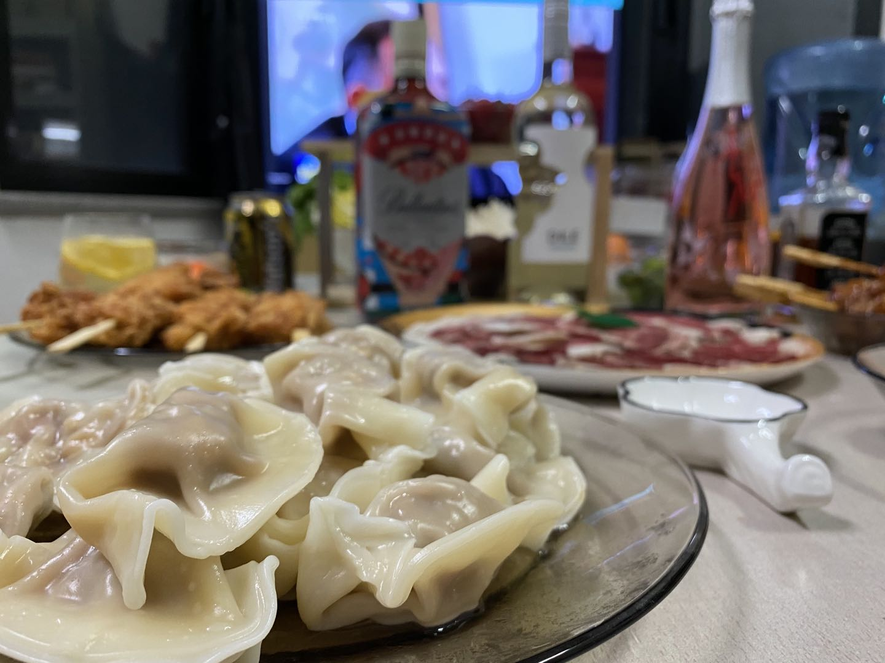

拍出高级感的年夜饭

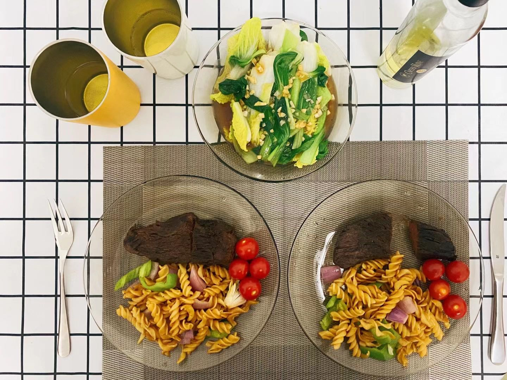

Few shot learning 的厨艺杰作

---

### 杂记

下面是一些碎碎念，想到哪写到哪。

#### 感情问题

这个方面要写的话可能要很长很长了，大多其实在分手信里提过，就不在这里细说了。从去年这个时候开始，就觉得和梁之间的距离越来越远了，不仅仅是物理上的距离。我觉得最主要的原因还是观念上的不同，其他方面都是可以互相包容的。当我发现我们**平时习以为常的行动、话语会经常让对方感到不愉快**之后，我就觉得这段感情可能要走不下去了。不同于之前，有刚开始认识的伪装、有共同学校生活的加持、有一定的距离带来的偏置，在褪下这些滤镜后，我们能建立的情感联结和支持变得微乎其微，甚至为零。我们无法互相理解对方难过的点，导致自我感动的安慰在对方来看就像是火上浇油，我也无力应对情绪的无底洞，对于我来说终究还是太难了。

最后一次见面是在平安夜，我们看了一场黄西老师的脱口秀，用最开心的方式作出最伤感的决定。直到最后散场，我其实都没有勇气直接说出分手，总觉得很愧疚，最后还是在回去的车上才把事情说清楚了，那时已经是圣诞节。五年，有太多美好的回忆，却没有童话般的结局。**从 2015 年的清明节凌晨在一起，到 2020 年的圣诞节凌晨分开，说起来也挺有意思的**，总是在奇怪的节点做奇怪的事，就像我们的性格和观念一样也总是反的。不管怎样，我十分珍惜贯穿大学时光的这段感情，谢谢你，同时也对不起。

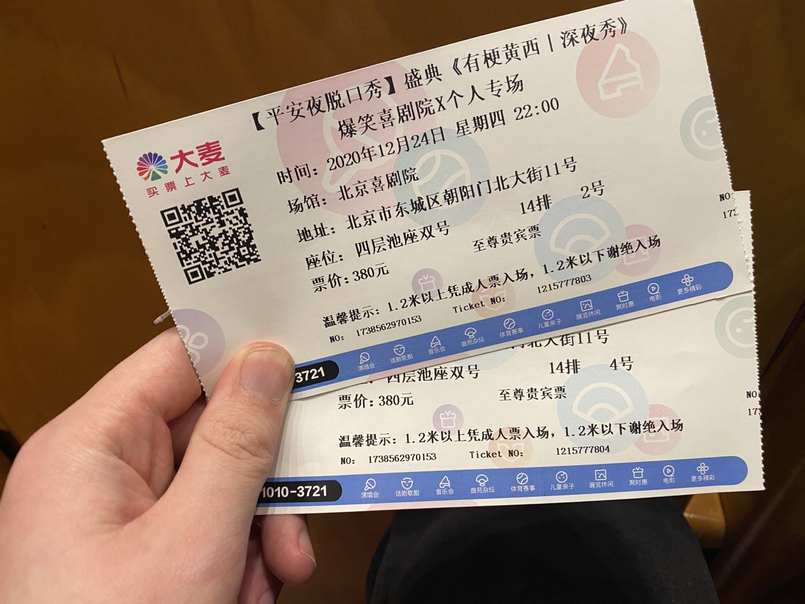

平安夜最后的脱口秀

这之后，我也对自己究竟喜欢什么样的女生有了更多的思考。以前的我一直觉得在感情面前没有什么是不能互相磨合与包容的，都可以通过沟通解决，互补的性格也许会带来更宽广的眼界和机会，我总是这样安慰自己。但现在我觉得，人是很难改变的，即使为了一个人改变自己也是暂时的。现在的我会倾向于寻找观念相合，至少对于身边事情的认知大多是一致的类型；另外两个人最好各有所长，同时有所交集，维持一种平等的关系，对方不擅长的方面没做好也能够互相包容（回想之前梁就总是希望在各个方面都显示出自己懂得很多，而对于我没做好的地方求全责备）；两人朋友的交集也很重要，我跟梁都跟对方的朋友一起出去玩过，但共同的感觉是融不进去对方的圈子，不是一类人；此外相比梁那种知性稳重的女生，我果然还是更喜欢天真活泼，两个人互相依赖的类型。

碎碎念了这么多，感觉主要还是以之前不满意的点为负例来对比学习了，只希望接下来能调整自己，享受单身自由生活的同时谨慎对待可能到来的下一段感情，珍惜身边能够交心的朋友。

#### 未来规划

虽说这一年是比较无忧无虑的一年，也没到抉择未来规划的时候，但时不时也会去想自己毕业后到底会走哪条路。其实现在摆在我面前的无非两个方向：当老师做科研、去工业界进公司。我分析了一下两者的优劣：

* 当老师做科研
  * 优点
    * 进入长聘期后十分稳定、不担心子女的教育问题，符合我求稳的性格；
    * 工作的自主性相对更高，可以自己把控的时间更多。
  * 缺点
    * 相比能力更看重机会，没有合适的机会很难找到顶尖高校的教职；
    * 青年教师阶段考核压力大，淘汰率高；
    * 不喜欢写项目本子的感觉，感觉在承诺空头支票最后还要自信地圆回来；
    * 容易产生自我怀疑，认为自己做的东西没有实际价值；
    * 自身的理论实力限制了发展的天花板，注定难以成为有重大发现的研究者。
* 去工业界进公司
  * 优点
    * 相比机会更看重能力，并且有机会拿到高薪；
    * 为一个切实可见的目标不断迭代前行，能看到付出的价值，从而产生自我认同。
  * 缺点
    * work-life balance 难以得到保障，压力更大，容易焦虑；
    * 需要考虑房子和教育问题；
    * 不稳定，可能会经常跳槽；
    * 需要慢慢转变自己的核心竞争力，为后期做准备。

其实现在来看两者都有比较明显的优点和缺点，优点中也都有符合我性格的因素在，实在是很难抉择。感觉还是**要多跟走不同方向的学长学姐了解一下，问一问他们现在最大的困境是什么，看自己更不愿意接受哪个**。从现在的信息来看，如果有比较好的教职机会我还是会尝试一下，之后的隐性福利太吸引我了，就不用操心太多杂七杂八的东西，能够更多专心在业务上，相比自我认同感的获得来说我有信心把控好自己的心态。

#### 游戏

想单独提一下的原因是今年确实玩了不少游戏，而且不像之前沉迷 DNF 这类网游，这一年更多是体验了一个又一个艺术品，感受游戏作为第九艺术的存在。上半年疫情在家只有 switch，于是体验了不少之前一直想玩但没时间的作品。返校之后有了 PC，再加上收了阎导的 2080 显卡，可选择的游戏大作多了很多。

* **马里奥奥德赛**（S+）：教科书式的箱庭解谜游戏，找回了小时候翻石头找蜗牛的乐趣，任天堂 yyds。
* **只狼**（S+）：传统日式风格 + 胜负就在一呼一吸间的战斗，我太爱了，疫情前打到三周目双难修罗的 boss，回来马上四周目白金。
* **死亡搁浅**（S+）：很不一样的游戏体验，带来快乐的点和其他游戏完全不同，对于我来说是让无序变得有序的快感，以及他人雪中送炭的感动，越到后来越沉迷基建，不愧为一众「棍子」游戏中的「绳子」游戏。
* **荒野大镖客 2**（S+）：非常牛逼的开放世界，就是前三章节奏有点慢了，学期中一直沉不下去没有共鸣，到寒假一鼓作气打通还沉浸其中，从第四章开始几乎挑不出毛病，剧情、探索、细节、画面都是神级。
* **HADES**（S+）：接下了以撒的大旗，近乎完美的 Rougelike 游戏，不仅动作流畅剧情也很契合，刚玩那一段时间真的停不下来，上手就是一天。
* **赛博朋克 2077**（S）：现象级游戏，剧情和沉浸感无敌，特别是我的菜，个人的游玩体验上看画面和 bug 不是啥问题，战斗和数值有点崩坏，总体还是挺满意的，但确实有很大提升的空间。
* **空洞骑士**（S）：很喜欢此类的硬核横版动作游戏，世界观和地图容量也惊艳到我（本科时打完十字路口以为要结束了没继续打）。
* **鬼泣 5 特别版**（S）：最喜欢的动作游戏系列，特别版出了V 哥，又帅又好用，打了 DMD 难度全 S，结果发现用 V 哥打没有这个成就...
* **烟火**（S）：虽然披着恐怖游戏外皮，本质更像一部反封建破迷信的电影，时代设定很讨喜，故事讲得也很不错，恐怖元素对我来说恰到好处，为国产恐怖游戏树立了很好的榜样。
* **奥日 1、奥日 2**（A+）：游戏不错，也不愧为艺术品，画面和音乐满分，但缺少一些打动我的共鸣点。
* **动物森友会**（A）：个人向评分，游戏非常好但可能不太适合我，节奏还是有些慢了，而且身边同学没有持续玩下去。
* **异度之刃决定版**（A）：剧情和世界观还算比较戳我，但对画质和玩法还是有点嫌弃，毕竟是很老的游戏了。
* **武士零**（A）：像一部电影，短小精悍，剧情和叙事不错，战斗到后来其实有点乏味。
* **世界游戏大全 51**（A-)：很难评价，作为一个小游戏的整合确实还不错，但也没有什么惊艳的地方。
* **风花雪月**（A-）：经典的战棋玩法，剧情其实一般，还流程贼长，另外难度一定要高，不然养成完全没意思。
* **八方旅人**（B）：怀旧经典，画风和战斗不错，就是剧情太像宝宝睡前故事了。
* **火影忍者疾风传**（B）：打折入的其实就为看个剧情，演出效果很好，弥补了火影后期没看动漫的遗憾，战斗看着华丽其实没啥可深挖的，体验不是很好，主要看看大招。

---

### 总结

总的来看，本命年这一年还是挺传奇的，一方面确实收获了不少正面的反馈，也完成了心态和情绪朝积极方向的转变；另一方面结束了一段长达五年的感情，也面临着越来越近的未来选择焦虑。但不管怎么说，这喜忧参半的本命年算是过去了，从我自身来评价的话还是在往好的方面前进的，慢慢有种**「守得云开见月明」**的感觉。希望之后能坚持做得不错的方面，比如主动与人交流、规律生活，同时继续加强自身的输入，能感到后半年这方面明显有所松懈。下一个愿望就是争取能遇到或者抓住一份真挚的感情吧 hhhh